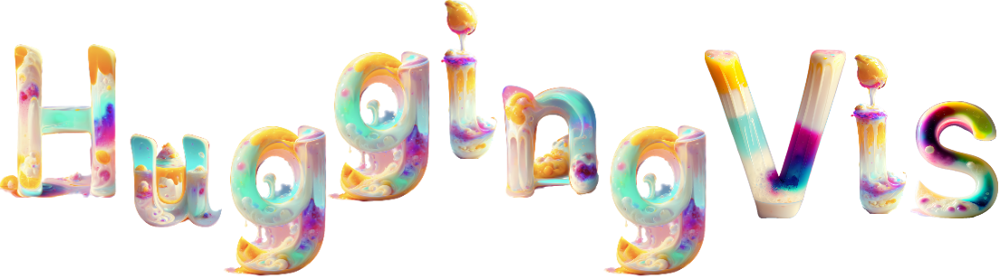

    <!-- license badge -->
    

### 项目简介

视觉是人类获取信息的重要方式之一，计算机视觉是通往通用人工智能（AGI）的重要工具。HuggingVis项目将关注视觉生成任务（包括图片、三维、视频生成）。首先从视觉信息编码和压缩的方法切入，理解不同方法的基本原理；然后依次分析图片、三维和视频三个模态的生成和编辑实现原理；最后介绍视觉生成的社区和行业生态。

### 立项理由

自GPT问世以来，自然语言大模型（LLM）已经逐渐深入人们日常生活和工作当中。同时，视觉大模型也不甘示弱，以Stable-Diffusion系列、DALL系列、Imagen系列的二维图片生成大模型也在被大家广泛使用；随着NeRF、3DGS等三维基础表征技术的进步和更迭，越来越多三维生成的模型也随着雨后春笋一般涌现，并表现出能生成越来越逼真和管线友好的3D物体生成；在短视频泛滥的当下为视频生成模型提供了大量的高质量数据饲料，使得视频生成大模型能朝着高一致性和高可控性方向上一路狂奔。 我们将借助该项目让更多人了解其原理并能更好使用视觉生成大模型，尤其是想帮助是对此感兴趣想深入研究的同学或者想利用相关技术做一些新产品的朋友。

### 项目受众

项目适合以下人员：

- 学生。希望通过学习相关技术，入门视觉生成式大模型，学习底层技术，以及开展相关研究工作。
- 相关或非相关行业从业者。对视觉生成大模型（图片、三维、视频生成）感兴趣的朋友，以及希望在实际中运用视觉技术创造新的服务或解决现有问题。

项目不适合以下人员：

- 公式的详细推导。
- 对其他技术细节感兴趣，例如low-level的视觉任务等。

### 项目亮点

- 底层原理的阐述。用清晰直观的插图以及由浅入深的公式推导，让大家更容易理解相关算法原理
- 提供示例代码和使用教程。

### 项目规划【内容持续更新中，欢迎关注～】

本项目初稿在不断更新中，在线阅读: [HuggingVis](https://datawhalechina.github.io/hugging-vis/)

**第一部分 视觉生成方法**

- 1 变分模型

  - 1.1 变分自编码器（VAE）✅
  - 1.2 条件变分自编码器（CVAE）✅
  - 1.3 向量量化变分自编码器（VQVAE）✅
- 2 对抗模型

  - 2.1 基础模型-对抗生成网络（GAN）✅
  - 2.2 架构优化与条件生成（DCGAN CGAN PGGAN）✅
  - 2.4 风格控制-风格对抗生成网络（StyleGAN）✅
- 3 流模型

  - 3.1 概念与结构（NICE）✅
  - 3.2 改进与优化（RealNVP Glow）
- 4 扩散模型

  - 4.1 数学基础 ✅
  - 4.2 加噪与去噪 ✅
  - 4.3 采样加速 ✅
  - 4.3 架构优化 ✅

**第二部分 视觉生成原理**

- 5 图片生成与编辑

  - 5.1 主流模型结构（stabledifusion dalle 注意力机制）
  - 5.2 可控生成 （controlnet系列）
  - 5.3 模型微调 （dreambooth LoRA textual-inversion）
  - 5.4 图片反推 （DDIM-Inversion）
- 6 三维生成与编辑

  - 6.1 背景及应用
  - 6.2 三维表征
  - 6.3 三维生成
  - 6.4 三维编辑
- 7 视频生成与编辑

  - 7.1
  - 7.2

**第三部分 社区与发展**

- 8 社区与发展
  - 8.1 社区生态
  - 8.2 行业应用
    - 二维场景：营销作图、游戏作画、美图工具等
    - 三维场景：游戏、数字人、电影、虚拟资产、vision pro内容等
    - 视频场景：抖音、b站、直播等

### 主要贡献者

<table border="0" >
  <tbody>
    <tr align="center" >
      <td>
          
         <a href="https://github.com/xjli360">Xiaojie Li</a> 
         
清华大学硕士

      </td>
      <td>
          
         <a href="https://github.com/guanidine">Letian Zhang</a>
         
清华大学硕士

      </td>
      <td>
          
         <a href="https://github.com/joyenjoye">joye</a> 
        
Data Scientist

      </td>
      <td>
          
         <a href="https://github.com/KashiwaByte">Bote Huang</a>
         
西安电子科技大学本科

      </td>
    </tr>
  </tbody>
</table>

### 致谢

特别感谢 [Sm1les](https://github.com/Sm1les)对本项目的帮助与支持。
感谢[Tango](https://github.com/it-worker-club)对2-2章节提供的帮助；感谢[AnSuZeaT](https://github.com/AnSuZeaT)对6-1章节提供的帮助；
感谢[Fantastic121380](https://github.com/Fantastic121380)对1-1章节提供的帮助；感谢[flawzhang](https://github.com/flawzhang)、[mxztflow](https://github.com/mxztflow)、[QJieWang](https://github.com/QJieWang)对本项目提供的帮助。

### 关注我们

扫描下方二维码关注公众号：Datawhale

  Datawhale，一个专注于AI领域的学习圈子。初衷是for the learner，和学习者一起成长。目前加入学习社群的人数已经数千人，组织了机器学习，深度学习，数据分析，数据挖掘，爬虫，编程，统计学，Mysql，数据竞赛等多个领域的内容学习，微信搜索公众号Datawhale可以加入我们。

### LICENSE

 本作品采用<a rel="license" href="http://creativecommons.org/licenses/by-nc-sa/4.0/">知识共享署名-非商业性使用-相同方式共享 4.0 国际许可协议</a>进行许可。
