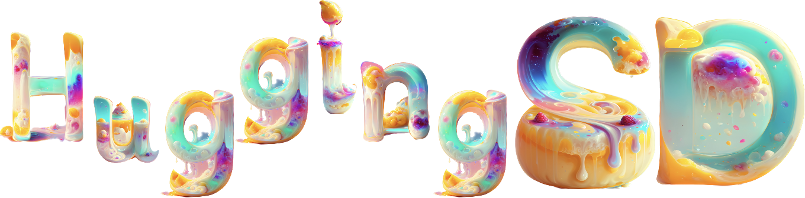

    <!-- license badge -->
    

### 项目简介

受到[HuggingLLM](https://github.com/datawhalechina/hugging-llm)项目的启发，本项将介绍以stable-diffusion为代表的视觉生成大模型的原理、使用和应用，降低使用门槛，让更多感兴趣的同学能够无障碍使用SD创造价值。

### 立项理由

以stable-diffusion为代表的视觉生成大模型正在深刻改变视觉领域中的上下游任务（包括二维、三维、视频）。且正在改变许多行业，比如绘画、3D建模、影视、游戏等等。我们将借助该项目让更多人了解并使用视觉生成大模型，尤其是对此感兴趣、想利用相关技术做一些新产品或应用的朋友。希望新的技术能够促进行业更快更好发展，提高人们工作效率和生活质量。AI for humans!

### 项目受众

项目适合以下人员：

- 学生。希望通过学习相关技术，了解视觉生成模型的原理和应用，或是开发新应用，或是入门视觉生成式大模型，或是做相关算法究等。
- 相关或非相关行业从业者。对stable-diffusion或视觉生成大模型感兴趣，希望在实际中运用该技术创造提供新的服务或解决已有问题。

项目不适合以下人员：

- 研究底层算法细节，过于
- 对其他技术细节感兴趣。

### 项目亮点

- 深入学习视觉生成模型的原理和应用，包括二维、三维、视频等。
- 熟悉stable-diffusion原理及相关API的使用和理解。
- 提供示例代码和使用流程。

### 项目规划【内容持续更新中，欢迎关注～】

1 视觉生成方法I

- 1.1 [变分自编码器](./docs/chapter1/第1章-视觉生成方法I.md)
- 1.2 生成对抗网络

2 视觉生成方法II

- 2.1 流式模型
- 2.2 [扩散模型](./content/1-2%20DDPM算法.ipynb)
  - 训练过程
  - 采样过程
  - 优化方法

3 图片生成

- 3.1 可控生成
  - 条件引导与无条件引导
  - ControlNet
- 3.2 模型微调
  - 参数微调 dreambooth LoRA
  - 文本反推 textual-inversion
- 3.3 StableDiffusion结构

4 图片编辑

- 4.1 图片反推 DDIM-Inversion
- 4.2 注意力机制
  - 交叉注意力
  - 自注意力
- 4.3 基于模型的图片编辑

5 三维生成与编辑

- 5.1 三维表征
  - [表征方法](./content/3-1%20背景及应用.md)
  - [NeRF/3DGS](./content/3-2%20NeRF神经辐射场.ipynb)
- 5.2 三维生成
  - [基于2D模型蒸馏](./content/3-3%20文生3D.md)
  - 基于2D模型训练
- 5.3 三维编辑

6 视频生成与编辑

- 6.1 视频生成
- 6.2 视频编辑

7 社区

- 7.1 [社区生态]((./content/8-1%20社区生态.md))
- 7.2 行业应用
  - 二维场景：营销作图、游戏作画、美图工具等
  - 三维场景：游戏、数字人、电影、虚拟资产、vision pro内容等
  - 视频场景：抖音、b站、直播等

### 主要贡献者

<table border="0" >
  <tbody>
    <tr align="center" >
      <td>
          
         <a href="https://github.com/xjli360">Xiaojie Li</a> 
         
清华大学硕士

      </td>
      <td>
          
         <a href="https://github.com/guanidine">Letian Zhang</a>
         
清华大学硕士

      </td>
      <td>
          
         <a href="https://github.com/joyenjoye">joye</a> 
        
Data Scientist

      </td>
      <td>
          
         <a href="https://github.com/KashiwaByte">Bote Huang</a>
         
西安电子科技大学本科

      </td>
    </tr>
  </tbody>
</table>

### 致谢

特别感谢[Sm1les](https://github.com/Sm1les)对本项目的帮助与支持。
感谢[Tango](https://github.com/it-worker-club)对文生图部分提供的帮助；感谢[AnSuZeaT](https://github.com/AnSuZeaT)对视频生成部分提供的帮助；
感谢[Fantastic121380](https://github.com/Fantastic121380)对视觉生成算法部分提供的帮助；
同时也感谢[flawzhang](https://github.com/flawzhang)、[mxztflow](https://github.com/mxztflow)、[QJieWang](https://github.com/QJieWang)对本项目提供的帮助和支持。

### 关注我们

扫描下方二维码关注公众号：Datawhale

  Datawhale，一个专注于AI领域的学习圈子。初衷是for the learner，和学习者一起成长。目前加入学习社群的人数已经数千人，组织了机器学习，深度学习，数据分析，数据挖掘，爬虫，编程，统计学，Mysql，数据竞赛等多个领域的内容学习，微信搜索公众号Datawhale可以加入我们。

### LICENSE

 本作品采用<a rel="license" href="http://creativecommons.org/licenses/by-nc-sa/4.0/">知识共享署名-非商业性使用-相同方式共享 4.0 国际许可协议</a>进行许可。
