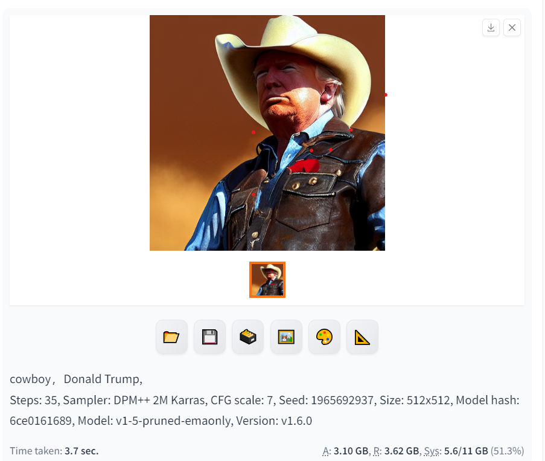
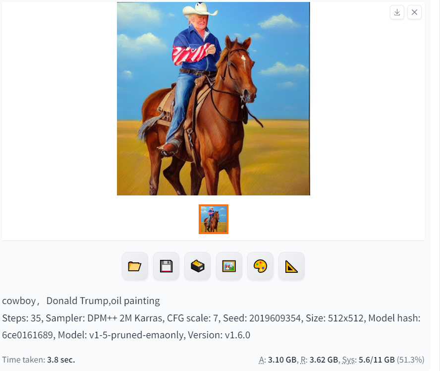
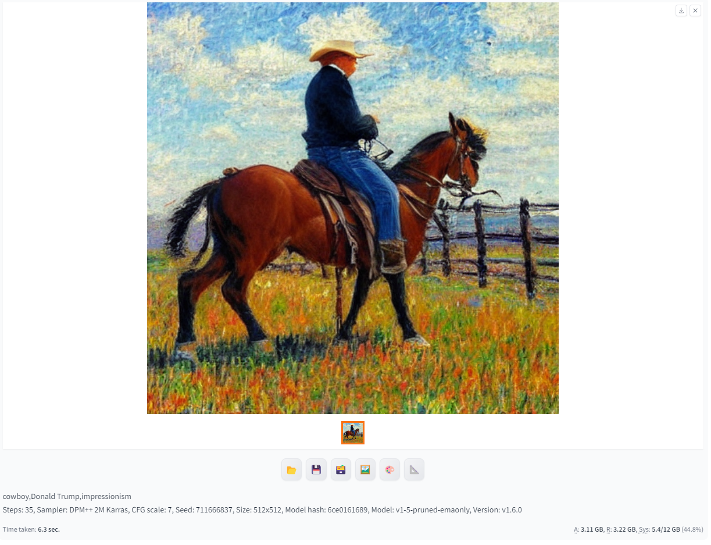
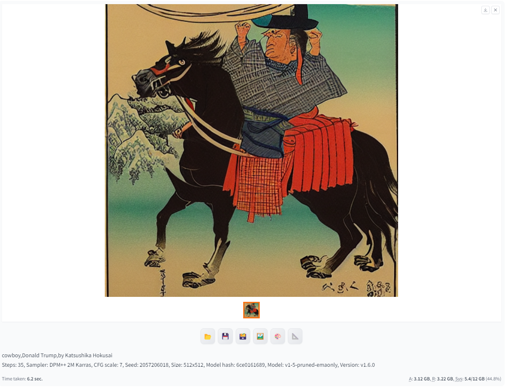
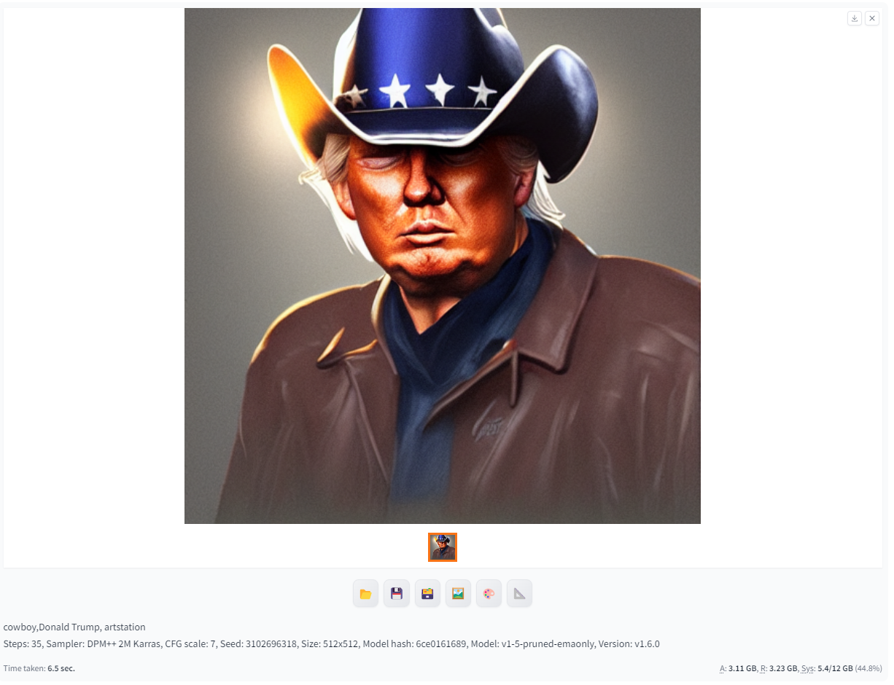
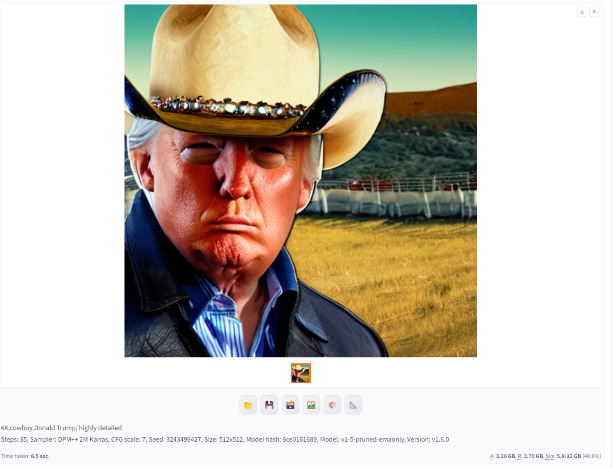
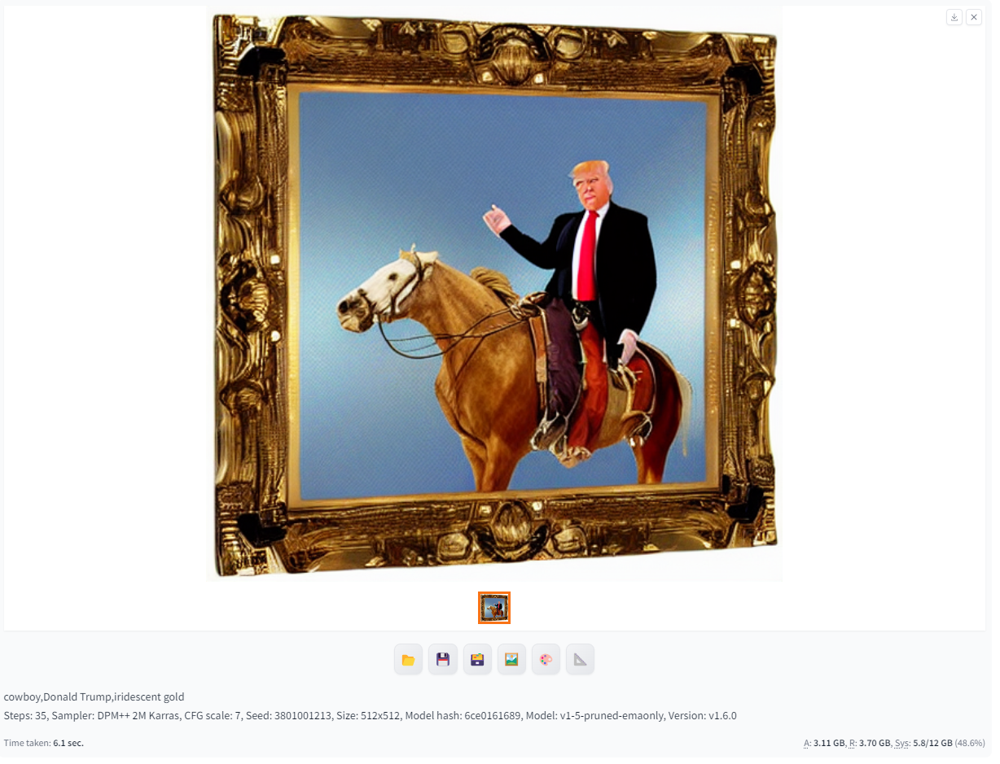
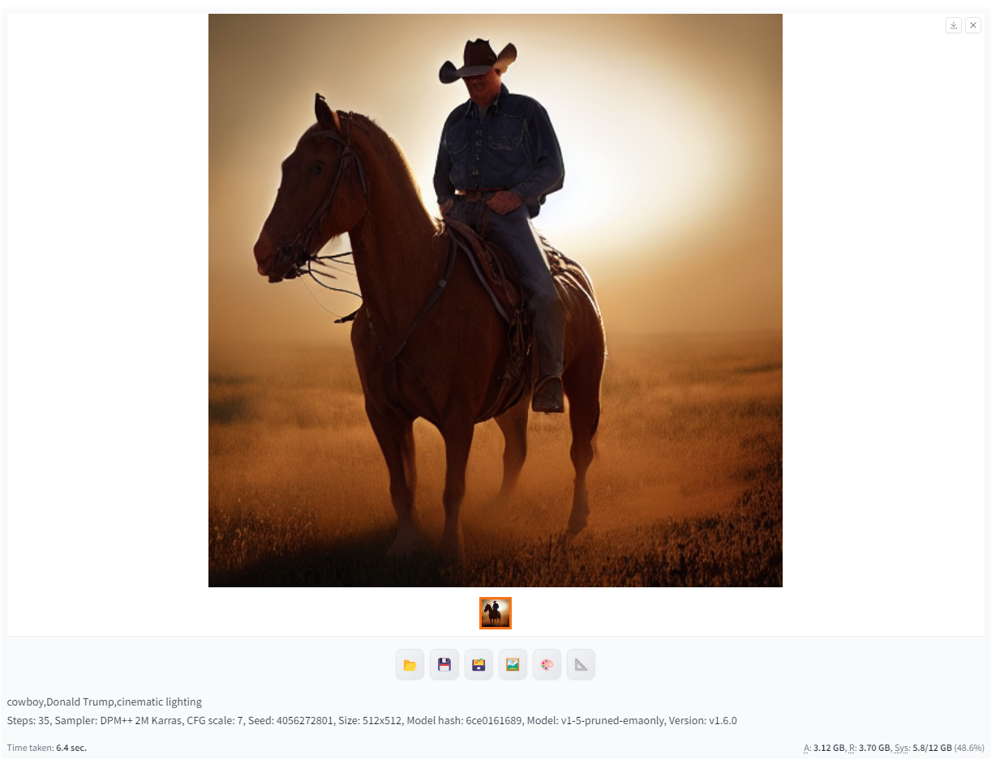

# 2-1 提示词

## 0 章节目标

- 了解提示词的基本类型
- 了解不同类型提示词使用方法
- 了解提示词的使用效果

## 1 正面提示词类型
一组好的提示词往往包含多个类型方面，每个不同的类型描述可以达到不同的效果，经过多个描述的综合作用就能够生成优质的AI艺术品。

以下内容以 v1-5-pruned-emaonly这个模型作为示例，内容主体我们选择Donald Trump（美国前总统）。采样器我们选择DPM++ 2M Karras，采样步数我们选择35，CFG Scale选择7，高度和宽度都是512。

### 1.1 类型概述
提示词的类型主要包含以下几类：
* 主题（subject）
* 材质（Medium）
* 风格（Style）
* 艺术家（Artist）
* 参考网站（Website）
* 分辨率（Resolution）
* 颜色（Color）
* 光影（Lighting）

每次的提示词撰写都可以依据这个类型清单进行选取和构思。需要注意的是，提示词用英文撰写可以达到更好的效果，因此一些提示词会是一些简单的英文词汇。

### 1.2.1 主题（Subject）
主题就是我们需要生成的主要内容，比如一个人物，或者一个物品。由于Stable Difussion是需要理解自然语言再生成图像内容的，因此选取名人往往更能够达到一个好的效果，因此在这里我们选取特朗普作为我们今天的主角。此外我们为特朗普设定一个西部牛仔的风格，从而更好的展现Stable Difussion的强大能力。

我们很快得到了西部牛仔着装的特朗普，效果看起来还不错。同时我们可以根据后续类型提示词的添加一步步看到提示词的强大影响力。

### 1.2.2 材质（Medium）
材质指的是绘画的材料如油画，照相，3D等，材质同样对绘画结果有着非常巨大的影响。
让我加上关键词 oil painting（油画)

可以看到加上这个提示词之后生成的效果就明显有了油画的风格。

### 1.2.3 风格（Style）
风格指的是图像的艺术风格，比如说印象派，波普艺术，巴洛克艺术等。比如说我们可以加上impressionism（印象派）提示词来生成图像。

可以看到这幅画的明显就有了印象派画风的味道。

### 1.2.4 艺术家（Artist）
艺术家是占比很重的提示词。Stable Difussion允许您使用特定的艺术家作为参考，此外使用多个艺术家的名字来混合他们的风格也是很常见的。现在让我们加上日本经典画家葛饰北斋（神奈川冲浪的作者）作为提示词。by Katsushika Hokusai，名称前需要加上一个 by 来表示是作者。

可以看到浓浓的和风瞬间就来了，背景的山和浪甚至可以在他的经典作品中找到出处。

### 1.2.5 参考网站（Website）
许多绘画网站聚集了一些小众但却优质的图像画风，我们可以选择在提示词中加入来获得特定的画风。比如说我们可以在提示词中加入 artstation（一个原创画师分享平台）

### 1.2.6 分辨率（Resolution）
分辨率表示图像的清晰度和细节。让我们添加高度详细（highly detailed） 和4K关键字。就可以获得更加精细化的图片。

可以看到特朗普脸上的毛孔都看得更清楚了。

### 1.2.7 颜色（Color）
我们还可以通过添加颜色关键字来控制图像的整体颜色。可以指定整体色调的颜色或者特定物体的颜色
让我们添加符合西部牛仔风格关键字彩虹金色（iridescent gold）。

可以看到马和画框都成了彩虹金色。

### 1.2.8 光影（Lighting）
在摄影和绘画领域，光影是关键要素，在Stable Difussion中同样可以指定光影关键词，比如说让我们添加电影灯光（cinematic lighting）提示词。

可以看到加了光影之后，整体的感觉瞬间就高级了。

# 2 负面提示词

## 2.1 负面提示词概述
除了使用以上类型的正面提示词，使用负面提示词是另一个控制图像生成的好方法，但是这里不是放入你想要的内容，而是放入你不想要的内容。负面提示词不仅可以是物体，也可以是不需要的属性(例如丑陋、畸形)。

以下是一些常用的负面提示词，大家也可以根据这些示例获得对负面提示词的一些基本了解：

> ugly, tiling, poorly drawn hands, poorly drawn feet, poorly drawn face, out of frame, extra limbs, disfigured, deformed, body out of frame, bad anatomy, watermark, signature, cut off, low contrast, underexposed, overexposed, bad art, beginner, amateur, distorted face, blurry, draft, grainy

> 丑陋、平铺、手画得不好、脚画得差、脸画得差、四肢多余、毁容、变形、身体出框、解剖学不好、水印、签名、截断、对比度低、曝光不足、曝光过度、艺术不好、初学者、业余爱好者、脸部扭曲、模糊、草稿、颗粒状

## 2.2 负面提示词使用指南
对于初学者来说，可以收集一些通用的负面提示词，然后在每次作画的时候直接加上。而对于熟练使用者来说，可以不断增添一些关键词来避免一些崩坏内容的生成，比如说Stable Difussion的一些模型可能画不好手，因此可以在负面提示词中加入手（hand），或者画的坏的手（poorly drawn hands）。（当然手的问题可以通过一些插件如Controlnet解决）

# 3 提示词技巧
在了解了提示词的两大类型之后，我们可以开始介绍一些提示词的高阶使用技巧。

## 3.1 关键字权重
我们可以根据语法: 

    (关键字: 因子)   (keyword:factor)

来调整关键字的权重。因子是这样一个值，小于1意味着不太重要，大于1意味着比较重要。通过调整因子的值就可以获得显著的效果。

