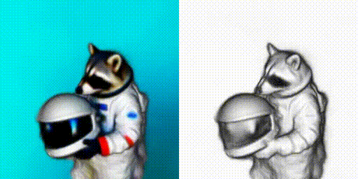
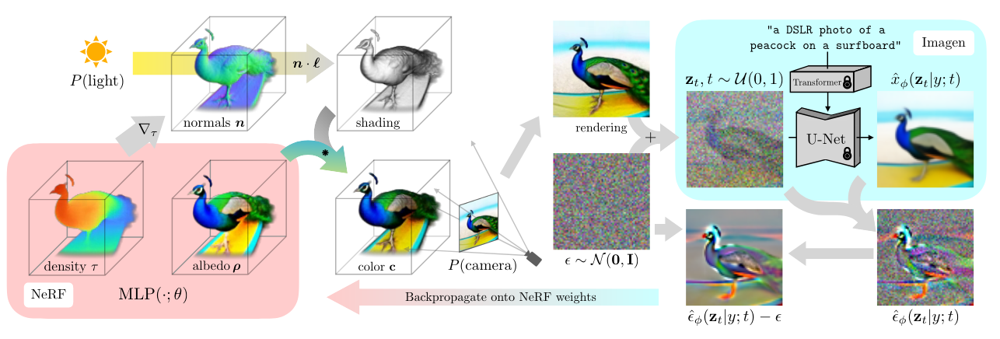
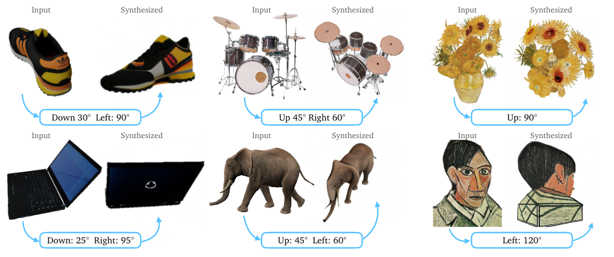
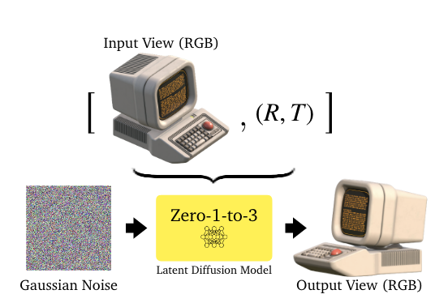
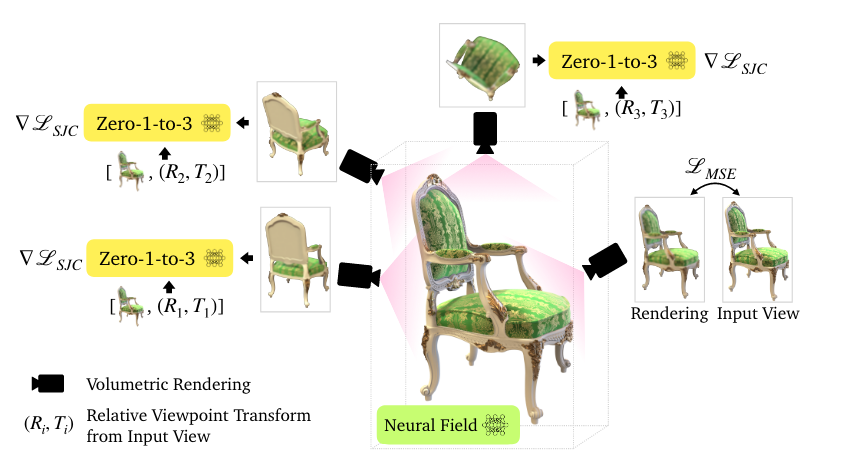

# 3-3 文生3D
(目录)

# 0 章节目标
- 理解Dreamfusion、zero123原理，理解文生3D原理
- 会运用文生3D的能力到自己项目中

# 1 显式生成方法
显示生成方法中有[3-1](./3-1%20背景及应用.md)中所介绍的[point-e](https://github.com/openai/point-e)、[shape-e](https://github.com/openai/shap-e)等工作。

<table>
    <tbody>
        <tr>
            <td align="center">
                
            </td>
            <td align="center">
                
            </td align="center">
            <td align="center">
                
            </td>
        </tr>
        <tr>
            <td align="center">A chair that looks like an avocado</td>
            <td align="center">An airplane that looks like a banana</td>
            <td align="center">A spaceship</td>
        </tr>
        <tr>
            <td align="center">
                
            </td>
            <td align="center">
                
            </td>
            <td align="center">
                
            </td>
        </tr>
        <tr>
            <td align="center">A birthday cupcake</td>
            <td align="center">A chair that looks like a tree</td>
            <td align="center">A green boot</td>
        </tr>
        <tr>
            <td align="center">
                
            </td>
            <td align="center">
                
            </td>
            <td align="center">
                
            </td>
        </tr>
        <tr>
            <td align="center">A penguin</td>
            <td align="center">Ube ice cream cone</td>
            <td align="center">A bowl of vegetables</td>
        </tr>
    </tbody>
</table>

这种方式生成的3D物体，易于修改，但是可以看到渲染质量并不好。当隐式的表征特别是dreamfusion横空出世之后，3d生成方面的许多工作都围绕它来展开了。

# 2 隐式生成方法
在[3-2 NeRF神经辐射场](./3-2%20NeRF神经辐射场.ipynb)章节我们详细介绍了nerf的原理以及使用，在此基础上，我们将在这个章节介绍一下分别通过隐式生成方法和显式生成方法来带大家了解3D生成的主流方法，以便于大家能快速入门并掌握基本的用法，同时也以此了解行业发展方向。

首先我们了解隐式生成方法的生成方法，在[3-2 NeRF神经辐射场](./3-2%20NeRF神经辐射场.ipynb)中我们有详细介绍五种目前主流的三维表征方法，后两种即[SDF](https://en.wikipedia.org/wiki/Signed_distance_function)和[NeRF](https://en.wikipedia.org/wiki/Neural_radiance_field)是隐式的表征方法，显然隐式生成方法的生成方法就是利用sdf和nerf的表征来生成三维的物体和场景。本章节将主要讨论的是基于nerf的隐式生成方法，基于sdf的会简单介绍。

## 1-1 DreamFusion
首先，dreamfusion论文来自[DreamFusion: Text-to-3D using 2D Diffusion](https://arxiv.org/abs/2209.14988)，看下效果。

"a raccoon astronaut holding his helmet"

跟显式的表征方法对比，可以看到质量有明显的提升，但是质量还远未到真正可以用的地步。下面我们大致讲一下Dreamfusion的原理。

- 首先，通过2D的文生图大模型（这里采用的是[Imagen](https://imagen.research.google/)）得到图片a
- 同时，在空间中随机初始化一个NeRF，然后NeRF选择一个视角pose并rendering得到一张图片b，注意图片的输出与Imagen输出的图片分辨率保持一致
- 然后，将图片叠加随机噪声放入大模型中进行去噪过程并得到a'。DM的去噪过程实际上是在估计噪声，然后估计的噪声和添加的噪声之间求loss。所以a'与加入的高斯噪声相减，便有了c'。
c'将直接用来更新NeRF的权重，从而使render的结果b更加真实，如此迭代下，最终便可以得到text-to-3D的效果。

实质上NeRF的作用可以看作是一个大的约束器，去监督生成模型生成符合这个约束器的一系列连续视角的图片。

更多细节请参考：[DreamFusion: text-to-3D using 2D diffusion](https://www.zhihu.com/search?type=content&q=dreamfusion)

(Todo 代码演示)

## 1-2 Zero123
首先，Zero123论文来自[Zero-1-to-3: Zero-shot One Image to 3D Object](https://arxiv.org/abs/2303.11328)，看下效果。

这种方法输入将一张RGB的图片和一个pose(视角)输入一个已经在sd上微调过的大模型中，然后模型根据输入输出一个关于这张图对应视角的图像。

通过这样的方法，可以生成很多不同视角的图像。然后再放入[NeRF](./3-2%20NeRF神经辐射场.ipynb)类的方法中进行训练得到最终的辐射场。

可以通过[huggingface-zero123](https://huggingface.co/spaces/cvlab/zero123-live)、[zero123](https://zero123.cs.columbia.edu/)亲自动手玩一玩，直观的感受下。
注意，由于目前很多方法都有后文所提到的缺点[3 缺点与改进]()，所以为了能生成更好更高质量的内容，需要注意以下几点：

- 尽量保持图片清晰且背景为白或单一
- 尽量保证图片中仅包含一个物体，可以采用iphone抠图操作
- 物体尺寸不易太大，物体在图片中占比适中即可

## 1-3 其他方法

## 3 缺点与改进

