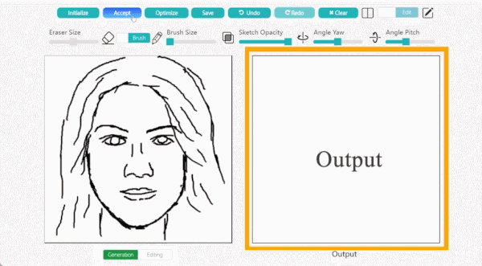
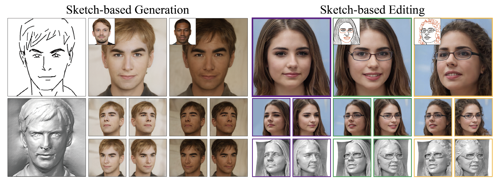

# 3-4 可控3D生成
（目录）

# 0 章节目标
- 了解2D图片可控生成与3D生成方法
- 理解3D可控生成的方法

# 1 背景

在2D的图像生成中，当我们想要得到想要的照片时，在原始的StableDiffusion中可能需要不断的“念咒语“(加入一些我们想要的特征的语言描述)，但是这样往往需要经过多次调整，并且可能还得不出来我们想要的内容。

于是，一名斯坦福的华人博士提出了[ControlNet](https://arxiv.org/abs/2302.05543)，此方法一经推出便迅速引起大家关注和讨论，由此开启了可控的2D图片生成新篇章。本项目在[2-4-4 ControlNet]()章节也有对该内容有详细介绍。

在[3-3 文生3D](./content/3-3%20文生3D.md)章节中我们详细介绍了目前文生3D用到的方法，主流的方法还是从2D的预训练多模态大模型中，比如SD中利用2D的先验去合成连续性的3D物体或者场景。

# 2 可控3D生成

## 2.1 SketchFaceNeRF 

