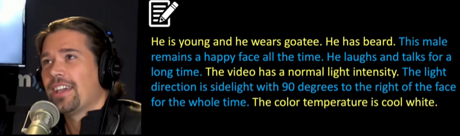

# 5-1 背景及应用

- [5-1 背景及应用](#5-1------)
  - [视频任务](#----)
    - [数据集](#---)
    - [评价指标](#----)
  - [视频生成](#----)
  - [视频编辑](#----)
  - [视频理解](#----)
  - [总结](#--)

## 视频任务

扩散模型在视频领域的任务分类可概括为：视频生成、视频编辑以及视频理解。其中视频生成包括条件约束（文本、深度、姿态、深度、声音）生成、无约束生成、视频补全等任务。视频编辑包括文本引导、多模态引导、风格迁移、上色等多种视频编辑任务。视频理解包括：动作检测、视频追踪、分割、文本-视频检索等任务。相比图像生成任务，视频生成模型需要额外解决时间、人物一致性等问题，且可用数据远小于图像任务。如果忽略帧间序列的连续性，视频任务就退化为图像生成任务。

### 数据集

在以往的视频任务中，视频数据存在时间短，分辨率低，场景专一等问题。想要完成Text-2-Video任务就需要构建新的数据集。可以将目前存在的视频数据集分为两类。

- Caption-level Datasets
    标注级数据集，数据集由视频标注对组成，示例来自[CelebV-Text](https://github.com/CelebV-Text/CelebV-Text)。
    
- Category-level Datasets
    分类级数据集,数据集由视频与简单的分类组成，示例来自[UCF101](https://arxiv.org/abs/1212.0402)，往往用于视频动作识别。
    

Text-2-Video需要分辨率更高、场景更加丰富、标注更加清晰的数据集，但是目前这样的数据集较少，不可避免的使用以往视频任务如动作识别、视频分割任务的数据集。

### 评价指标

评估一段视频的质量具有一定的主观性。许多研究采用了主观评分法，通过从视频的真实性、连续性、以及与文本的一致性等各个角度进行投票，以评定生成视频的优劣。为了消除评价者个人偏好的影响，需要有大量的人对每段视频进行评价，这无疑增加了评价的成本。尽管如此，为了对生成视频的质量进行定性和定量的研究，仍然可以从图像和视频两个方面出发，设定一些评价指标。然而，必须明确，这些指标并非衡量生成视频优劣的金标准。

- Image-level Metrics

由于视频是由一系列图片构成的，因此可以通过评估单帧图片的质量来对整个视频进行评估。常用的图像质量评价指标包括Frechet Inception Distance (FID)、Peak Signal-to-Noise Ratio (PSNR)、Structural Similarity Index (SSIM)以及CLIPSIM等。FID主要用于测量生成图像与原始图像在Inception V3模型下的特征向量之间的距离。SSIM则用于评价原始图像与生成图像在亮度、对比度和结构特性上的相似度。[PSNR](https://en.wikipedia.org/wiki/Peak_signal-to-noise_ratio)则代表了峰值信号与均方误差之间的比例系数。而CLIPSIM则通过CLIP模型提取图像和文本特征，以判断生成图像与输入文本间的一致性。此外，Inception Score (IS)、Perceptual Path Length (PPL)等指标也被广泛用于评价生成图像的质量。

- Video-level Metrics

与图像级评价指标类似，常用视频类评价指标包括：Video Distance (FVD) ，Kernel Video Distance (KVD) ，Frame Consistency CLIP Score。

## 视频生成

由于直接训练Text-2-Video模型难度与开销较大，常常使用T2I模型完成T2V任务。

## 视频编辑

## 视频理解

## 总结
