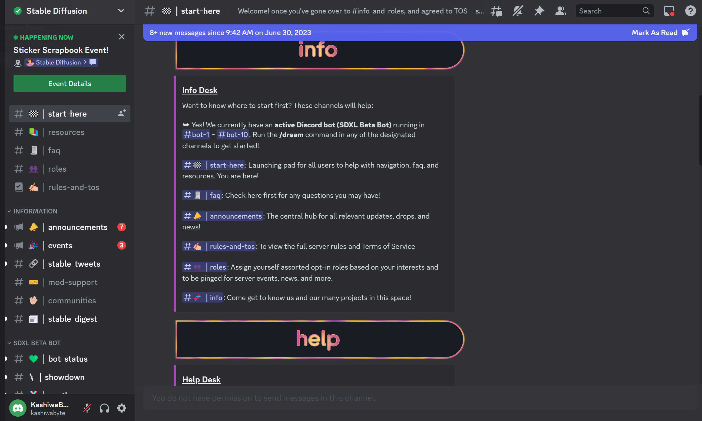
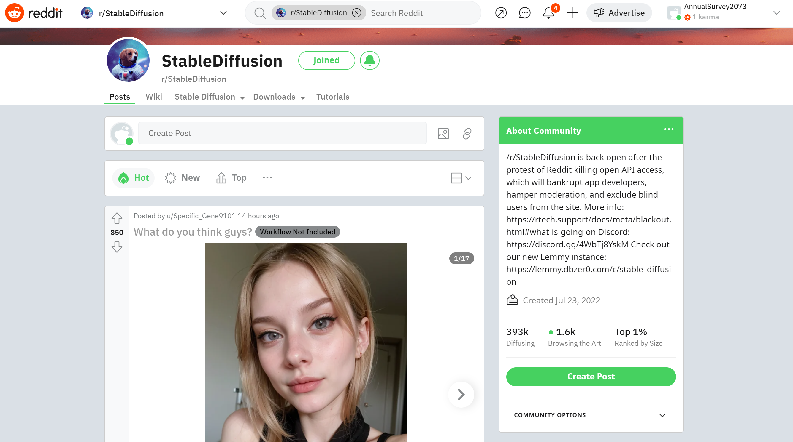
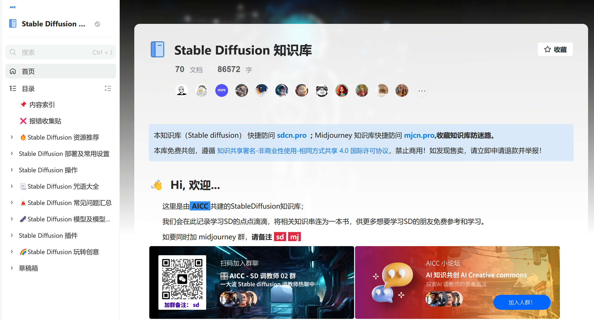
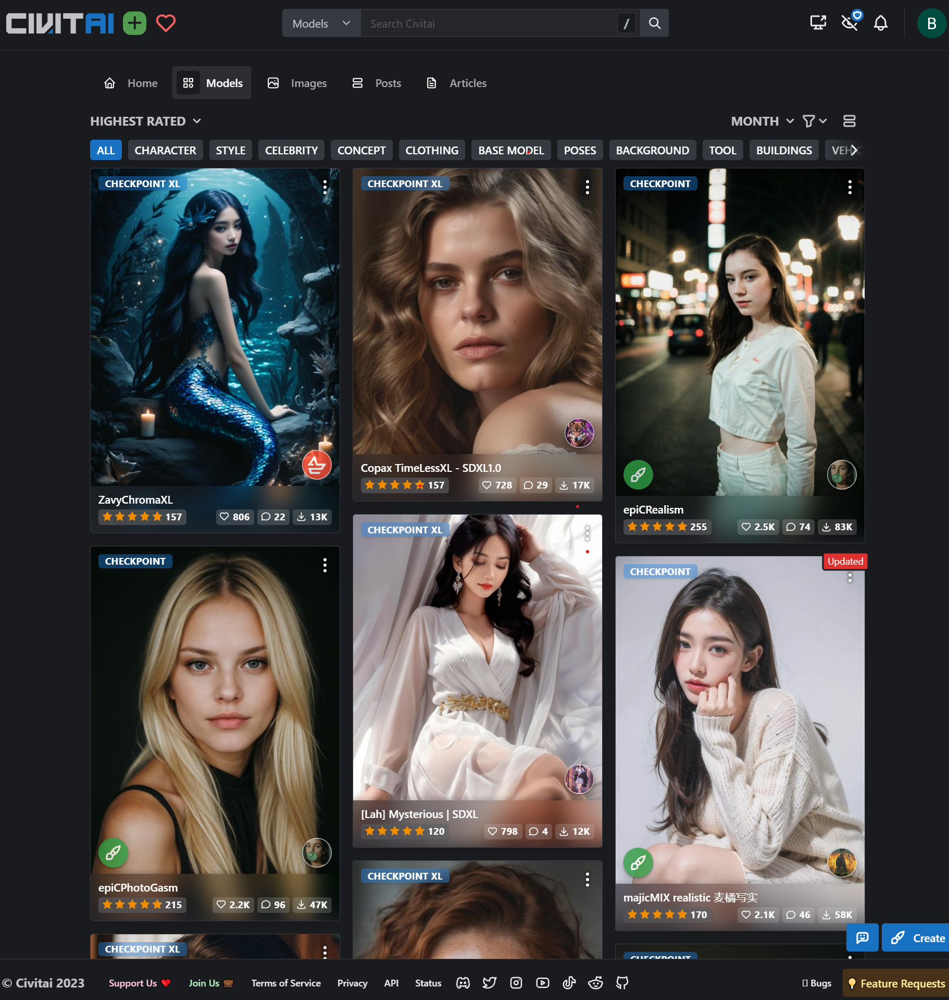
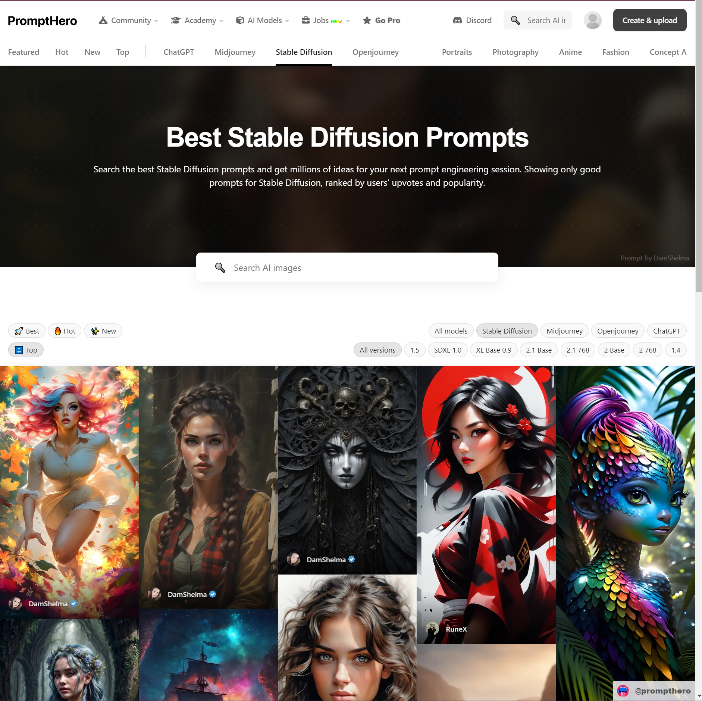
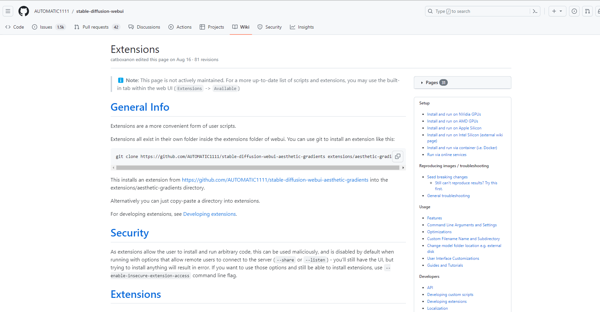
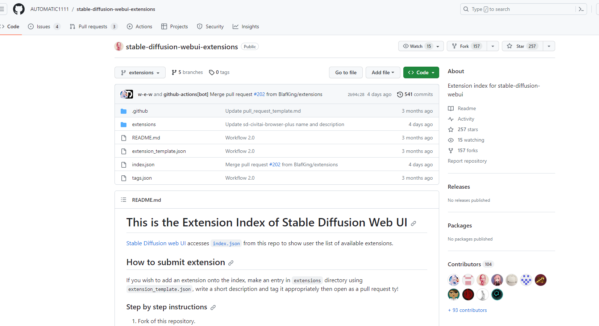

# 8-1 社区生态

- [8-1 社区生态](#8-1-社区生态)
  - [0 章节目标](#0-章节目标)
  - [1 社区概述](#1-社区概述)
  - [2 全面性社区](#2-全面性社区)
    - [2.1 Discord](#21-discord)
    - [2.2 Redit](#22-redit)
    - [2.3 语雀](#23-语雀)
  - [3 专业性社区](#3-专业性社区)
    - [3.1 模型社区 Civitai](#31-模型社区-civitai)
    - [3.2 提示词社区 PromptHero](#32-提示词社区-prompthero)
    - [3.3 插件社区](#33-插件社区)
  - [4 社区总结](#4-社区总结)

## 0 章节目标

- 了解SD相关的综合性社
- 了解SD相关的插件、提示词与模型社区

## 1 社区概述
Stable Difussion 因其开源性质形成了大大小小的生态社区，其中既有大而全的讨论社区，也有专精于如提示词，大模型等领域的小而精的社区。须知上述篇章只是Stable Difussion乃至AI绘画的入门，持续的精进与紧跟潮流是离不开社区生态的。

## 2 全面性社区

### 2.1 Discord
最广为人知也最值得关注的当属Discord的Stable Difussion频道值得注意的是Discord是一个国外社区平台，因此需要魔法才能访问。为方便实际操作，频道内专业术语翻译会用括号加上英文原文作为注释。   （https://discord.com/channels/1002292111942635562/1097851711697203220）。

Discord的Stable Difussion频道主要包含以下几个部分：  
* 新手入门区（START HERE）：包含频道的基本介绍，频道所能提供的资源（resources）主要是介绍一些有关Stable Difussion的站点。包括使用站点，社区站点，微调站点等。 频道的常见问题解答（faq），频道的规则（rules-and-tos）。  
* 消息区（INFORMATION) ：
    * 公告（annoucements）：频道内各个用户的公共讨论区。
    * 事件（events） ：发布一些频道内活动的结果和重大活动的通知。
    * 推特转发（stable-tweets） ：转发一些有关Stable Difussion的tweet资讯。
    * 社区推广（communities） ： 发布一些有关AI绘画的其他Discord频道，如Midjourney，Inboke AI等。
    * 文摘（stable-digest）： 总结并发布关于Stable Difussion的重要信息。并且每一期都会有一个Stable Difussion生成的杂志封面。
* SDXL测试机器人区（SDXL BETA BOT）：
    * 机器人状态（bot-status）：发布bot的运行状态的相关信息。
    * 投票（showdown） ：你可以在这里投票给你喜欢的作品让他们荣登榜单。
    * 榜单（pantheon）：展示高票榜单。原文非常中二我在此也贴出来  。
    （欢迎来到万神殿，所有胜利的一代都沐浴在他们闪闪发光的成就之中  
     Welcome to the Pantheon; where all winning generations bask in their glimmering achievement! ）
    * 展示（show-and-tell-xl）： 这里自由发布展示SDXL生成的作品。
    * 反馈（bot-support-feedback）：集中社区成员使用时遇到的问题。
    * 机器人（bot-1 bot-2 ... ): 用户可以选择发送提示词给bot生成两幅图画，频道成员可以投票给其中一幅来塑造bot未来的生成内容。
* 活动区（EVENTS0： 有关社区内各种各样的活动，活动的讨论，活动的信息等
* SD讨论区（STABLE DIFUSSION): 自由讨论区，包含sdxl，tech-support，animations，finetune等子区。
* 开发者区（DEVELOPER ＆ API): 
    * 各类SD相关api与sdk开发的区域（如platform，dreamstudio，stablestudio，stable-animation 等） 
    * 应用场合（intergrations）： 讨论如何将SD整合进现有应用的子区
    * ui开发（stableswarm-ui） ：讨论SD ui界面的子区
    * 开发者（developers）：讨论SD应用开发的开发者子区

综合来看Stable Difussion的Discord频道基本能够提供全景式的SD内容信息了。

### 2.2 Redit
Reddit是国外的一个论坛平台，reddit的Stable Difussion频道同样提供了全景式的资讯。该频道主要分为侧边栏和主区，主区又分为几个不同的栏目。  
（https://www.reddit.com/r/StableDiffusion/）

* 侧边栏：
    * 第一个部分是频道的基本介绍（About Community），包括贴子数，访问数和频道在全论坛的排名情况。
    * 第二个部分是频道的资讯过滤（Filter by fair），可以排除你不想看到的帖子内容。
    * 第三个部分是频道的规则介绍（StableDifussion Rules），介绍了频道的基本11条规则。
    * 第四个部分是相关频道（Related Subs），介绍了一些相关的频道，如aiArt，sdforall等。

* 帖子区（Posts）：用户可以在该区发帖，同时浏览最热，最新，最有价值的帖子。
* 知识库区（Wiki）：该区域汇集了大量的知识包括如何安装，第三方插件，模型，社区，相关游戏，常见问题等。
* 安装区（Stabel Difussion）：提供了包括本地安装（local Install），应用网页（ Online Websites）和移动应用（Mobile APPS）的多端安装使用教程。
* 资源下载区（Downloads） ：包含插件下载和模型下载。
* 教程区（Tutorials）：包含文字教程，Youtube视频教程，此外还陈列了很多相关艺术画廊用于提示词教学与分享。
    
综合来看Reddit的生态和讨论度都比不上Discord，但是Reddit知识库的性质会更强，如果单纯需要Roadmaps式的学习路线，Reddit的知识库区（Wiki）会是更好的选择。

### 2.3 语雀
语雀是国内的一款文档管理和协同工具，非常适合建设成结构化的知识库。鉴于上述两个综合类社区都需要魔法才能使用，因此语雀的Stable Difussion知识库不妨可以作为一种平替。
（https://tob-design.yuque.com/kxcufk/sd）

Stable Difussion的语雀知识库主要包含以下几个部分。
* 内容索引：主要包含各部分的关键资源信息，包括部署的《google drive云端部署》，《win本地懒人包部署》。配置、出图、模型与提示词等，可以看作是新生指引站。
* 报错收集帖： 包含报错提交的格式与报错帖子。
* Stable Difussion 资源推荐： 不同部分的内容推荐汇总
    * 模型网址推荐：包含C站，Huggingface与专门的建筑类模型共享文档
    * 常用工具推荐：一些抠图，增强清晰度，或者辅助生成图片的工具
    * 优质教程推荐：包含Youtube，B站的视频推荐和图文教程推荐。数量不多且聚焦入门。
    * 相关GitHub推荐： 个人认为最有价值的部分，包含官方GUI，Colab等。
* Stable Difussion 部署及常用设置：包含云端，win，mac等多端部署，是个人见过最保姆的教程，提供包括下载资源网盘连接，按照流程顺序的图文教程与视频教程，甚至包含‘可能会遇到的问题’。不过目前提供的云端部署只提供了Google Colab的教程，更多国内云服务器的教程存在缺失，期待后续的更新，如有需要的可以直接去B站搜索教程。
* Stable Difussion 操作：这个部分专门讲述了SD Web UI的功能简介与不同操作下的常用参数。功能简介中主要介绍了大量的专有名词。推荐浏览一遍来了解SD Web UI具体能够做些什么。
    * 文生图篇：介绍提示词，负面提示词，采样步数，采样器等概念。
    * 图生图篇：介绍 Inpaint，outpainting，ControlNet等图生图技巧。
    
* Stable Difussion咒语大全：顾名思义是对提示词的专门讲解。
    * 提示词指南：详尽的提示词教学，包含基础概念，如何撰写，进阶等，同时还给出了一些经典提示词词典的链接。
    * 提示词相关资料：国外大师画廊式的pdf展示。
    * 提示词相关网站：国内外提示词资源会站和教学站。
    
* Stable Difussion 模型及模型训练: 包含模型与模型训练的入门与进阶知识
    * 拟合状态及正则化相关基础知识：给非相关专业人士的科普内容。
    * 常用模型推荐： 推荐了一些写实或者动漫的常用模型
    * 模型介绍： 介绍了模型的几个类别，Checkpoint，Lora等，同时和介绍了四类模型训练方式的对比。目前给出了Embedding和Dreambooth的实操。

* Stable Difussion 插件： 包含插件的基础知识和常用插件推荐

* Stable Difussion 玩转创意：介绍了一些有趣的SD用法，包含线稿上色，转成3D，艺术二维码，艺术logo设计等。

总的来说比起国外的Discord来说Stable Difussion的语雀知识库还并不成熟，一来是汇总类的资源非常有限，二来时社区的热度一般，三来则是内容目录的设置略有不合理。希望后续能够多加建设。

## 3 专业性社区

专业性社区相对来说数量很多，因此以下类别都将精选一个或几个介绍。

### 3.1 模型社区 Civitai
Civitai是模型社区当之无愧的王者，在这里你可以探索数千个高质量的模型，并且分享AI生成的艺术作品。   （https://civitai.com/）

以下是对Civitai具体模块的介绍：

* 主页（Home）：Civitai的主页会推荐一些模型照片和资讯，可以看作是休闲浏览区。你可以在这里看到最新大热的模型与最优秀的创作者。
* 模型（Models）：模型区主要是展览各种风格的模型，你可以直接搜索或者根据类型进行筛选。值得注意的是，模型区目前包含Pose区，从而方便了Contronet的使用。    
点击模型后会进入模型具体页面，这里提供不同的模型版本和下载，同时也会有一些预览图和其他创作者基于这个模型制作的图片。

* 图片（Images）：图片区主要展示的是各大创作者的优秀作品，每个作品点击进入后会有相应的Prompt参数和模型版本，同时也可以在此对图片进行评价和讨论。
* 展览（Post） ： 展览区与图片区类似，但更侧重于展示本身，这里通常会有一组作品展，同时不提供prompt和模型，但同样也支持评论。
* 文章（Articles）： 文章区主要汇集了一些创作者的创作心得和干货分享，同样也支持评论功能。

总的来说Civitai是一个聚焦于模型的社区，但是同样也融入了许多社交属性。

### 3.2 提示词社区 PromptHero
提示词社区一向是最多也最难以挑选的，不过在比对了十几个提示词社区后，我们综合易用性，活跃度与完整度选择了PromptHero。    
（https://prompthero.com/）

PromptHero对提示词的划分主要按照三大类别进行：
* 推荐算法：按照推荐算法进行划分，分别是最新 最热 最优，即 NEW HOT TOP。
* 归属模型：按照提示词使用的模型进行划分，包含ChatGPT,Midjourney,StableDifussion和Openjourney。
* 风格类别：按照风格类别如流行，照片，动漫，建筑，logo图标等进行划分

每张图片点击进入后会提供相应的提示词和模型

此外PromptHero上还会每周举办一个主题的AI绘画比赛，有兴趣的可以去积极尝试。

### 3.3 插件社区 
Stable Difussion的以其丰富的插件生态和可扩展性而闻名，利用插件不仅能够优化生成效果，修复生成错误（比如经典难题画手指），甚至还能够生成视频。

市面上的插件分享多是一些个人经验的汇总贴，可以用于参考但是实时性和全面性较差，这里推荐一个大而全的插件使用与介绍社区。那就是AUTOMATIC1111的Stable-difussion-webui库（一个最为经典的SD-Webui）中自带的插件Wiki与AUTOMATIC1111的Extensions库。
（https://github.com/AUTOMATIC1111/stable-diffusion-webui/wiki/Extensions）

以下是对这个Wiki的简单介绍：
* 总体介绍（General info）:对插件（Extensions）做出了准确的定义和使用说明。此外还给出了一个外链，里面是全部插件的汇总库。
* 常用介绍：在这里介绍了一些经典实用的插件并附带了插件的使用图，比如Clip Interrogator，PoseX等。基本上把这个Wiki里的插件吃透就能有非常不错的体验了。

再之后则是对Extensions库的介绍：
（https://github.com/AUTOMATIC1111/stable-diffusion-webui-extensions/tree/extensions）

这个库中的插件通过一个统一的Json格式进行收录，包含插件名称，下载地址，插件描述，收录时间与插件类别。
这里主要包含几个文件：
* 目录（index.json）：包含了全部的插件的json，差不多有数百个。
* 插件集（Extensions）：包含了每个插件的json文件。
* 标签总结(tags.json)：介绍了有些什么标签。

总的来说，最活跃与全面的插件社区恰好就是Github上的插件库。

## 4 社区总结
综合来看Stable Difussion具有丰富的社区生态，既包含大量的综合性社区如Reddit、语雀和Discord来提供全景式服务。又有小而精的专业社区，如插件社区，提示词社区和模型社区来提供更加垂直的内容。

当然以上的社区推荐也只是冰山一角，但我们相信社区选择在精不在多，只要能够熟练掌握和借助以上几个社区生态的力量，就一定能够成为一名优质的AI绘画大师。

