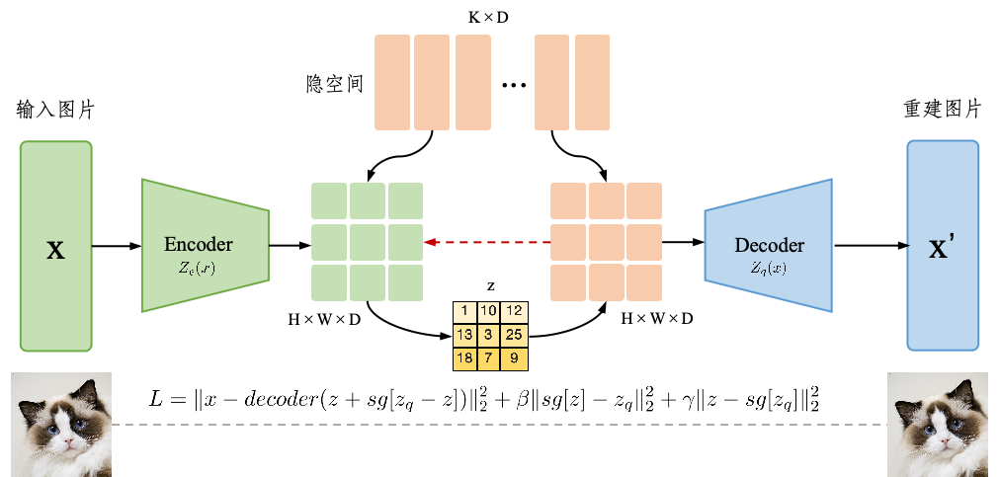

# 第1章 视觉生成方法I

&emsp;&emsp;视觉是人类感知外部世界获取信息的最重要的途径之一，视觉信息占人类从外界获取的信息的约80%。过视觉，人和动物能够感知外界物体的大小、明暗、颜色和动静，这些信息对生存至关重要。同理，在通往通用人工智能（AGI）的道路上，计算机视觉也在其中扮演者重要的作用。计算机视觉是一门让计算机能够处理和理解视觉信息（包括2D、3D、video等）从而来获得有意义信息的学科。在2012年，AlexNet算法使用深度卷积神经网络（CNN）在ImageNet挑战赛上赢得了冠军，展示了深度学习在计算机视觉中的巨大潜力，并由此引发了深度学习的热潮。在2022年，OpenAI公司推出了的基于Transformer架构的聊天机器人ChatGPT，，因其可以在许多知识领域给出详细和清晰的回答而迅速获得关注，并由此引发了新一轮的深度学习大模型热潮。不仅各类自然语言大模型层出不穷，同时各大公司也相继推出了视觉大模型，例如Stable-Diffusion系列、DALL-E系列、Imagen等。视觉大模型所采用的架构相差无几，因此本文将以Stable-Diffusion模型为代表，介绍视觉生成大模型的基础原理以及由其拓展的视觉应用。

## 1.1 变分自编码器(VAE)

> Just compress everything (压缩即智能) -- Ilya Sutskever

&emsp;&emsp;本小节介绍变分自编码器（Variational Autoencoder，VAE）。在讲VAE之前，有必要先简单介绍一下自动编码器（Autoencoder，AE），自动编码器是一种无监督学习方法，它的结构由Encoder和Decoder两部分组成。它先将高维的原始数据映射到一个低维特征空间，然后从低维特征学习重建原始的数据，其框架图如图1.1所示。

图1.1 自动编码器框架结构图

&emsp;&emsp;其中，Encoder将原始的高维度数据映射到低维度的特征空间中，这个低维空间往往比原始空间低得多；Decoder则是将这个低维空间重建回高维空间。假设一张图片 $x\in S$，$S$ 是一个高维空间，经过Encoder之后得到隐变量$z=g_{\phi }(x)，z\in V$，$V$ 是一个低维空间。然后利用Decoder对 $z$ 进行重建得到 $\hat{x} =f_{\theta }(z)=f_{\theta }(g_{\phi }(x))$，重建的 $\hat{x}$ 与原始数据 $x$ 相比会存在误差。我们可以用深度学习优化这个过程，使得重建的数据和原来的数据尽可能一致，其训练损失函数可以表示为：

$$
L_{AE}(\theta,\phi) = \frac{1}{n}\sum_{n}^{i=1}(x^i - f_{\theta }(g_{\phi }(x^i)))^2
$$

&emsp;&emsp;由于整个过程不需要对数据进行标注，因此AE是一种无监督学习方法。理想状态下，我们想利用Encoder得到对 $x$ 无损的压缩。AE类似于一个类似于一个非线性的PCA，是一个利用神经网络来给复杂数据降维的模型。

&emsp;&emsp;重新审视Decoder。 如果 $x_i$ 是一张猫咪的图片，那么 $x_i$ 可以看成是从一个猫咪的分布 $X$ 中采样得到。有趣的是，既然AE可以在Decoder环节从隐变量 $z_i$ 恢复回原始像素空间得到一张与原图很接近的图片，那么如果我给 $z_i$ 加一个扰动能不能也重建成与原图在一个分布 $X$ 下的图片呢？这样模型具有生成能力了！变分自编码器（Variational Autoencoder，VAE），就是要解决这样一个生成问题，它也由Encoder和Decoder两部分组成。假设 $z_i$ 是从一个已知分布 $p_\theta(z)=\mathcal{N} (z|0,I)$ 中采样得到的，那么Decoder可以表示为条件概率 $p_\theta(X|z_i)$ ，它的任务就是从在给定 $z_i$ 的条件下生成对应的 $x_i$。此处 $\theta$ 指的是分布的参数，比如对于高斯分布就是均值和标准差。我们希望找到一个参数 $\theta^*$来最大化生成真实数据的概率：

$$
\theta^*=argmax_\theta \sum_{i=1}^{n}\log p_\theta (x_i)
=argmax_\theta \sum_{i=1}^{n}\log (\frac{1}{m}\sum_{j=1}^{m}p_\theta (x_i|z_j))
$$

由于 $x_i$ 的维度很大，并且由于存在压缩，因此需要大量采样才能找到与 $x_i$ 相似的 $z_i$。

&emsp;&emsp;重新审视Encoder。假设已知后验分布 $p_\theta (z|x_i)$，根据贝叶斯公式得：

$$
p_\theta (z|x_i) = \frac{p_\theta(x_i|z)p(z)}{p_\theta(x_i)} = \frac{p_\theta(x_i|z)p(z)}{\int_{z}^{}p_\theta(x_i|z)p(z)dz }
$$

&emsp;&emsp;由此可见直接计算 $p_\theta (z|x_i)$ 仍需要大量采样 $z_i$采样得到。退而求其次，如果不能直接计算 $p_\theta (z|x_i)$ ，那么采用估计的策略，用变分贝叶斯算法的思路，由参数化的Encoder（即$q_\phi (z|x_i)$ ）来拟合后验分布 $p_\theta (z|x_i)$。由于似然 $p_\theta(X|z_i)$ 和 先验 $p(z)$都服从高斯分布，那么 $p_\theta (z|x_i)$ 也是服从高斯分布的，因此：

$$
q_\phi(z|x_i) = \mathcal{N}(z|\mu(x_i;\phi),\sigma ^2(x_i;\phi)*I )
$$

&emsp;&emsp;所以，Encoder仅需预测该分布的对应的高斯分布参数 $\sigma^2_i$ 和 $\mu_i$ 即可。但是由于存在采样过程，采样过程是离散过程，不能求导。于是，这里采用重参数化技巧（Reparameterization Trick），令$z_i=\mu_i+\sigma^2_i\odot \epsilon_i,\epsilon_i \in \mathcal{N}(0,I)$，$\odot$ 表示逐元素相乘，此时 $z_i$ 依然服从参数为 $\sigma^2_i$ 和 $\mu_i$ 的高斯分布。变分自动编码器的框架如图1.2所示。

图1.2 变分自动编码器框架结构图

&emsp;&emsp;现在，问题已经清晰，建模已经完成，如何用神经网络优化这个过程呢？即如何设计它的loss呢？问题落脚在如何衡量估计的后验分布$q_\phi(z|x)$ 与真实后验分布 $p_\theta(z|x)$ 之间的相似程度。评估两个分布差异最常用的方式就是计算KL散度，于是：

$$
D_{\mathrm{KL}}(q_\phi(\mathbf{z}|\mathbf{x})\|p_\theta(\mathbf{z}|\mathbf{x}))
=\log p_\theta(\mathbf{x})+D_{\mathrm{KL}}(q_\phi(\mathbf{z}|\mathbf{x})\|p_\theta(\mathbf{z}))-\mathbb{E}_{\mathbf{z}\sim q_\phi(\mathbf{z}|\mathbf{x})}\log p_\theta(\mathbf{x}|\mathbf{z})
$$

等价变换上述公式为：

$$
D_{\mathrm{KL}}(q_\phi(\mathbf{z}|\mathbf{x})\|p_\theta(\mathbf{z}|\mathbf{x}))
-\log p_\theta(\mathbf{x})=D_{\mathrm{KL}}(q_\phi(\mathbf{z}|\mathbf{x})\|p_\theta(\mathbf{z}))-\mathbb{E}_{\mathbf{z}\sim q_\phi(\mathbf{z}|\mathbf{x})}\log p_\theta(\mathbf{x}|\mathbf{z})
$$

其中 $\log p_\theta(\mathbf{x})$ 是真实数据的对数似然，目标是让它尽可能大；$D_{\mathrm{KL}}(q_\phi(\mathbf{z}|\mathbf{x})\|p_\theta(\mathbf{z}|\mathbf{x}))$ 是两个分布的KL散度，目标是让它尽可能小。于是优化目标等价于让等式右侧尽可能小。根据变分推断ELBO的优化目标得到训练优化目标：

$$
\begin{aligned}L_{\mathrm{VAE}}(\theta,\phi)&=-\mathbb{E}_{\mathbf{z}\sim q_\phi(\mathbf{z}|\mathbf{x})}\log p_\theta(\mathbf{x}|\mathbf{z})+D_{\mathrm{KL}}(q_\phi(\mathbf{z}|\mathbf{x})\|p_\theta(\mathbf{z}))\\\theta^*,\phi^*&=\arg\min_{\theta,\phi}L_{\mathrm{VAE}}\end{aligned}
$$

对比AE和VAE的两个损失函数能发现，VAE的损失函数像是AE的损失函数的基础上加了KL项作为正则，将Encoder的输出结果空间从较大的空间压缩到了接近后验分布 $ p_\theta(z|x)$ 的一个更小的空间中。

## 1.2 向量量化变分自编码器（VQ-VAE）

Less is more. -- Ludwig Mies van der Rohe

&emsp;&emsp;前面我们介绍了自动编码器（AE）和变分自动编码器（VAE），它们的隐变量$z$都是连续的，并且整个训练训练过程都是可微的。这样做的好处当然是有利于神经网络训练学习。但是这样连续的设计真的符合自然界中的直觉规律么？比如人类一句话是一系列离散的信号（以单词的组合形成语言）、一张组成猫咪的图片的特征是离散的特征（短毛或者长毛、斑点或者纯色等等）、一段音素是一系列离散的音帧组成。

&emsp;&emsp;所以向量量化变分自编码器（VQ-VAE）就应运而生，通过VQ的方式将隐变量$z$离散化，其框架如图1.3所示。其实从图中可以看出，VQ-VAE的结构更像是AE结构而不是VAE结构，因为其实它是将AE中连续的隐变量$z$变成不连续的"token"隐变量$z$，而$z$中存的是嵌入空间codebook的索引。因此如果用类比自然语言对语句的处理方式的话，VQ就像是图片的$tokenier$。

图1.3 向量量化变分自编码器框架结构图

那么这种图片的$tokenier$方式是如何实现的呢？首先，将图片$X$经过$Encoder$之后得到输入向量$z_e(x)$，大小为$H\times W\times D$；随后，

对于每个输出向量，在大小为$K\times D$的嵌入空间中找到其最近邻的向量，其索引表保存为$z$，所有$z_e(x)$的最近邻的向量组成输出向量$z_q(x)$；最后，利用$Decoder$将输出向量$z_q(x)$映射为重建图像$X'$。整个网络需要优化编码器$Encoder$、解码器$Decoder$和嵌入空间$codebook$。

由于VQVAE更本质上讲应该是AE的结构，因此整体优化目标是原始图像和重建图像之间的损失：

$$
L_{recon} = ||X - X'||_2^2=||X - Decoder(z_q(x))||_2^2
$$

但是，前面我们提到VQVAE的隐变量$z$是离散的，因此VQ的操作不可导，即从$z_e(x)$到$z_q(x)$是不可导的，那么就意味着梯度无法传递，那该如何用神经网络训练网络呢？

在VQVAE中采用直方估计（straight-through estimator）的技术来处理这一问题。直通估计是一种有效的近似梯度计算方法，如果在正向传播时在网络结构的某处遇到了离散或者不可导的操作，那么当反向传播到此处时，直接令其梯度为1。根据导数的链式法则，则可以保证整个网络优化的顺利进行。基于此算法，重新定义重建loss为：

$$
L_{recon} = ||x - Decoder(z_e(x) + sg(z_q(x) - z_e(x)))||_2^2
$$

其中,$sg$表示停止梯度运算的操作。

到此为止，我们可以优化编码器$Encoder$、解码器$Decoder$了。但是由于VQ的不可导并且在我们通过直方估计的方法，实质导致$L_{recon}$上跳过了对嵌入空间$codebook$的优化。由于VQ-VAE的最邻近搜索的设计，因此需要嵌入空间的向量和其对应编码器输出尽可能接近，所以嵌入空间的学习loss为：

$$
L_{e} = ||sg(z_e(x)) - z_q(x)||_2^2
$$

这样虽然能优化codebook，但是其实会导致训练难度加大，原因是$codebook$和$Encoder$之间存在紧密的联系，因为如果面对同一或者差异小输入$X$时，如果$z_e(x)$的差异较大，则会导致$codebook$在利用最近邻算法查找$ei$差异较大。因此需要建模它们之间的关系得到：

$$
L_e = ||sg(z_e(x)) - z_q(x)||_2^2 + \beta||z_e(x) - sg(z_q(x))||_2^2
$$

如此，VQVAE总体的损失函数可以写成：

$$
\begin{aligned}
L = &||x - Decoder(z_e(x) + sg(z_q(x) - z_e(x)))||_2^2 \\
&+ \alpha ||sg(z_e(x)) - z_q(x)||_2^2 + \beta||z_e(x) - sg(z_q(x))||_2^2
\end{aligned}
$$

其中，$\alpha, \beta$用于控制各个loss的比例。

## 1.2 对抗生成网络(GAN)

> It is not the strongest of the species that survive, but the one most responsive to change（物竞天择，适者生存） -- Charles Darwin

本小节介绍生成对抗网络（Generative Adversarial Networks，简称GAN），它也是一种生成模型，由伊恩·古德费洛等人在2014年提出。GANs通过生成器（Generator）和判别器（Discriminator）之间的对抗性过程来学习和生成数据。生成器的目标是捕捉数据分布，并生成与训练数据相似的新数据样本，生成器的输出旨在尽可能欺骗判别器，使其认为生成的数据是真实的。判别器的目标是区分真实数据和生成器生成的假数据，判别器在不断提高其区分能力，使其能够更准确地区分真实数据和生成数据。

何谓生成器？假设有一个猫咪的数据集，服从 $P_{data}(x)$ 的未知分布，生成器$G$的目标就是利用极大似然估计的方法来确定$\theta$来学习一个分布 $P_{G}(x;\theta )$ ，使得学习的 $P_{G}(x;\theta )$ 分布与目标数据集分布 $P_{data}(x)$ 越接近越好。接下来，如果想要生成猫咪的图片，只需要在学得的 $P_{G}(x;\theta )$ 采样即可。学习的分布离真实猫咪分布约接近，那么生成图片的猫咪也会越真实。

如何设计目标函数使得$P_{G}(x;\theta )$ 分布趋近于目标数据集分布 $P_{data}(x)$ 呢？前一章节提到的VAE的方法是采用KL散度来衡量两个分布的相似程度，而GAN则是通过巧妙地设计网络结构，将衡量两个分布相似程度地任务丢给神经网络判别起来判断，其框架图如图1.3所示。

图1.3 对抗生成网络框架结构图

GAN的原理是首先初始化一个正太分布的噪声，然后通过生成器网络生成猫的图片，然后将生成的猫的图片给判别器，让它判别该图片是真实图片还是生成的图片。判别器由真实猫咪的图片训练而来。在这个过程中不断迭代优化生成器使得生成的图片更像猫，同时使得判别器能更准确判别图片是否是生成的，优化函数描述为：

$$
\min_G\max_DV(D,G)=\mathbb{E}_{\boldsymbol{x}\sim p_\mathrm{data}(\boldsymbol{x})}[\log D(\boldsymbol{x})]\boldsymbol{+}\mathbb{E}_{\boldsymbol{z}\sim p_{\boldsymbol{z}}(\boldsymbol{z})}[\log(1\boldsymbol{-}D(G(\boldsymbol{z})))].
$$

这样的过程恰似自然界中捕食者和被捕食着之间此起彼伏的竞争，但又相互依赖，相互进化。

TODO:VQ-GAN
