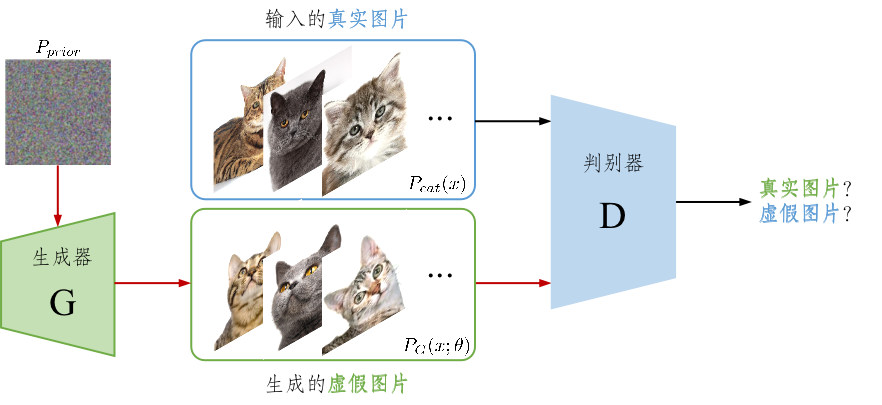

# 第2章 对抗模型

## 2.1 流式模型

> What I cannot create, I do not understand（我不理解我不能创造之物）-- Richard Feynman

## 1.3 对抗生成网络(GAN)

> It is not the strongest of the species that survive, but the one most responsive to change（物竞天择，适者生存） -- Charles Darwin

本小节介绍生成对抗网络（Generative Adversarial Networks，简称GAN），它也是一种生成模型，由伊恩·古德费洛等人在2014年提出。GANs通过生成器（Generator）和判别器（Discriminator）之间的对抗性过程来学习和生成数据。生成器的目标是捕捉数据分布，并生成与训练数据相似的新数据样本，生成器的输出旨在尽可能欺骗判别器，使其认为生成的数据是真实的。判别器的目标是区分真实数据和生成器生成的假数据，判别器在不断提高其区分能力，使其能够更准确地区分真实数据和生成数据。

何谓生成器？假设有一个猫咪的数据集，服从 $P_{data}(x)$ 的未知分布，生成器$G$的目标就是利用极大似然估计的方法来确定$\theta$来学习一个分布 $P_{G}(x;\theta )$ ，使得学习的 $P_{G}(x;\theta )$ 分布与目标数据集分布 $P_{data}(x)$ 越接近越好。接下来，如果想要生成猫咪的图片，只需要在学得的 $P_{G}(x;\theta )$ 采样即可。学习的分布离真实猫咪分布约接近，那么生成图片的猫咪也会越真实。

如何设计目标函数使得$P_{G}(x;\theta )$ 分布趋近于目标数据集分布 $P_{data}(x)$ 呢？前一章节提到的VAE的方法是采用KL散度来衡量两个分布的相似程度，而GAN则是通过巧妙地设计网络结构，将衡量两个分布相似程度地任务丢给神经网络判别起来判断，其框架图如图1.3所示。

图1.3 对抗生成网络框架结构图

GAN的原理是首先初始化一个正太分布的噪声，然后通过生成器网络生成猫的图片，然后将生成的猫的图片给判别器，让它判别该图片是真实图片还是生成的图片。判别器由真实猫咪的图片训练而来。在这个过程中不断迭代优化生成器使得生成的图片更像猫，同时使得判别器能更准确判别图片是否是生成的，优化函数描述为：

$$
\min_G\max_DV(D,G)=\mathbb{E}_{\boldsymbol{x}\sim p_\mathrm{data}(\boldsymbol{x})}[\log D(\boldsymbol{x})]\boldsymbol{+}\mathbb{E}_{\boldsymbol{z}\sim p_{\boldsymbol{z}}(\boldsymbol{z})}[\log(1\boldsymbol{-}D(G(\boldsymbol{z})))].
$$

这样的过程恰似自然界中捕食者和被捕食着之间此起彼伏的竞争，但又相互依赖，相互进化。

TODO:VQ-GAN
