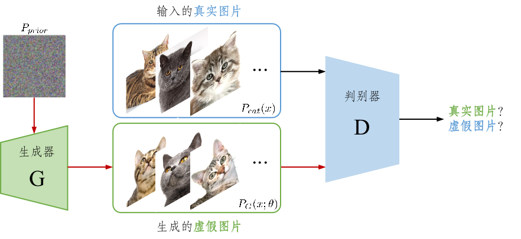
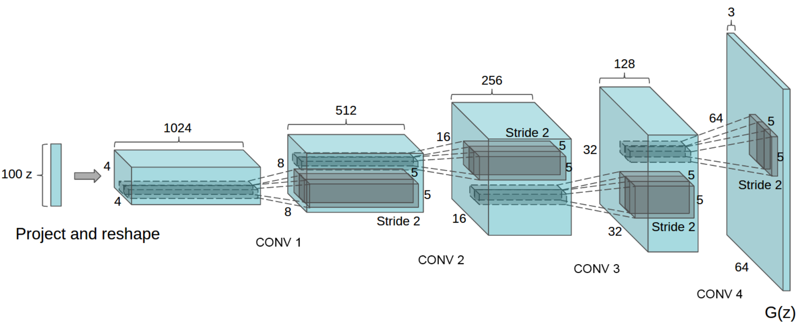
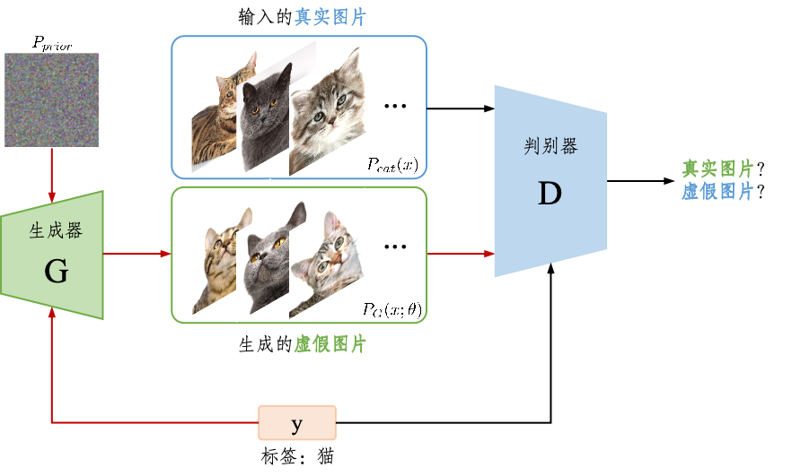
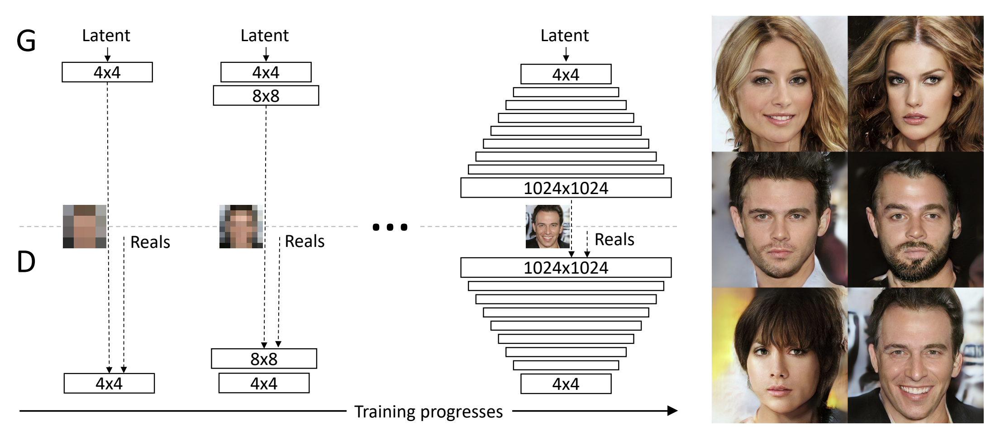
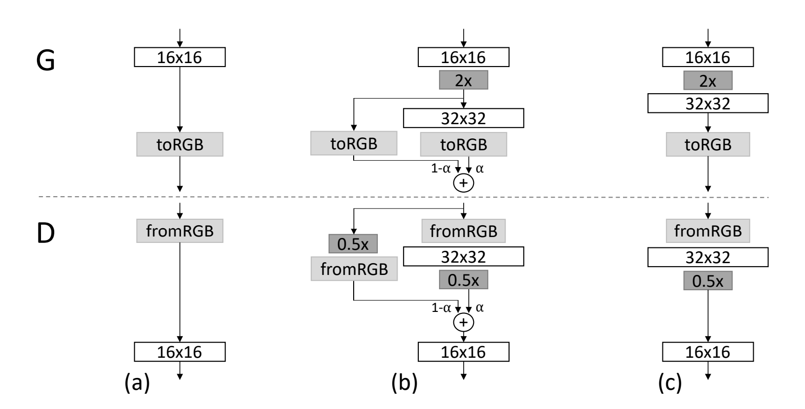
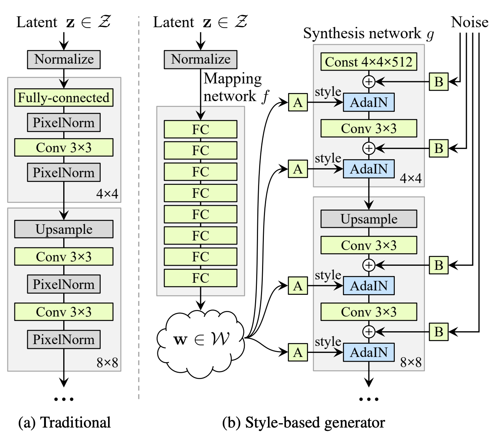
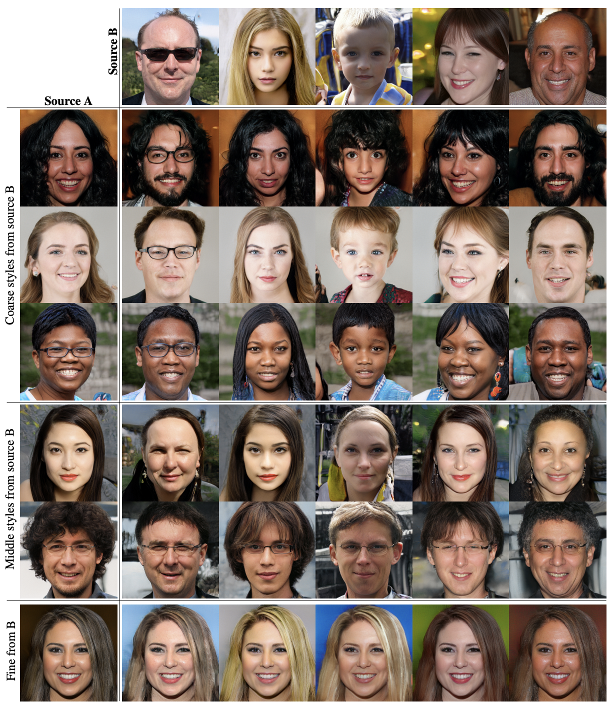

# 第2章 对抗模型

&emsp;&emsp;从自然法则的角度来看，优胜劣汰是生命进化的核心机制，它推动了物种的适应与生存。在这个过程中，只有最能适应环境变化、最具竞争力的个体能够存活并繁衍后代，而那些不适应的个体则会逐渐被淘汰。对抗生成网络（GAN）在某种程度上模拟了这一自然法则。GAN的核心机制是通过生成器与判别器之间的对抗博弈，生成器不断尝试生成更加逼真的数据，而判别器则致力于区分真实数据与生成数据。在这个过程中，生成器和判别器如同自然选择中的两个“物种”，彼此不断竞争、进化，优胜者不断推动系统性能的提升。从自然法则的优胜劣汰视角来看，GAN不仅仅是一种数学模型，更是一种模拟生物进化的动态机制，它通过不断的对抗与进化，实现了生成模型的优化与提升。

## 2.1 对抗生成网络(GAN)

> It is not the strongest of the species that survive, but the one most responsive to change（物竞天择，适者生存） -- Charles Darwin

&emsp;&emsp;本小节介绍生成对抗网络（Generative Adversarial Networks，简称GAN），它也是一种生成模型，由伊恩·古德费洛等人在2014年提出。GANs通过生成器（Generator）和判别器（Discriminator）之间的对抗性过程来学习和生成数据。在GAN的训练过程中，生成器不断优化其生成策略，力求“骗过”判别器，而判别器则必须通过识别生成数据的伪造痕迹来保持其竞争优势。随着训练的进行，生成器和判别器都不断适应对方的策略，彼此之间的博弈使得生成器能够产生越来越真实的数据。这一过程与自然界中的优胜劣汰机制相似，强调通过竞争和不断适应环境的变化来提升个体的能力。最终，只有经过这一过程的模型，才能在复杂的任务中取得成功，产生高质量的结果。生成器的目标是捕捉数据分布，并生成与训练数据相似的新数据样本，生成器的输出旨在尽可能欺骗判别器，使其认为生成的数据是真实的。判别器的目标是区分真实数据和生成器生成的假数据，判别器在不断提高其区分能力，使其能够更准确地区分真实数据和生成数据。

&emsp;&emsp;何谓生成器？假设有一个猫咪的数据集，服从 $P_{data}(x)$ 的未知分布，生成器$G$的目标就是利用极大似然估计的方法来确定$\theta$来学习一个分布 $P_{G}(x;\theta )$ ，使得学习的 $P_{G}(x;\theta )$ 分布与目标数据集分布 $P_{data}(x)$ 越接近越好。接下来，如果想要生成猫咪的图片，只需要在学得的 $P_{G}(x;\theta )$ 采样即可。学习的分布离真实猫咪分布约接近，那么生成图片的猫咪也会越真实。

如何设计目标函数使得$P_{G}(x;\theta )$ 分布趋近于目标数据集分布 $P_{data}(x)$ 呢？前一章节提到的VAE的方法是采用KL散度来衡量两个分布的相似程度，而GAN则是通过巧妙地设计网络结构，将衡量两个分布相似程度地任务丢给神经网络判别起来判断，其框架图如图1.3所示。

图2.1 GAN框架结构图

GAN的原理是首先初始化一个正太分布的噪声，然后通过生成器网络生成猫的图片，然后将生成的猫的图片给判别器，让它判别该图片是真实图片还是生成的图片。判别器由真实猫咪的图片训练而来。在这个过程中不断迭代优化生成器使得生成的图片更像猫，同时使得判别器能更准确判别图片是否是生成的，优化函数描述为：

$$
\min_G\max_DV(D,G)=\mathbb{E}_{\boldsymbol{x}\sim p_\mathrm{data}(\boldsymbol{x})}[\log D(\boldsymbol{x})]\boldsymbol{+}\mathbb{E}_{\boldsymbol{z}\sim p_{\boldsymbol{z}}(\boldsymbol{z})}[\log(1\boldsymbol{-}D(G(\boldsymbol{z})))].
$$

这样的过程恰似自然界中捕食者和被捕食着之间此起彼伏的竞争，但又相互依赖，相互进化。

## 2.2 架构优化与条件生成

> Perception is limited, but understanding is infinite（感知有限，理解无限）. -- Immanuel Kant

 &emsp;&emsp;最初的GAN模型使用全连接的多层感知器（MLP）作为生成器和判别器。虽然这种架构适用于一些简单的数据集（如MNIST），但在处理图像等复杂数据时，效果不佳。原因是多层感知器在处理图像信息时遇到以下问题：

- MLP不考虑图像中的空间结构信息，尽管MLP能够通过其全连接的层学习到某些全局特征，但它无法有效捕捉到图像中像素间的相邻关系或局部模式，导致它提取图片特征的能力有限。
- MLP中的每一层的神经元都与上一层的每个神经元全连接，因此需要大量的参数来描述网络的权重。特别是在处理高维图像时，参数的数量呈指数级增长，计算和存储开销非常大。
- 由于MLP没有考虑图像的空间结构，它对于图像中的物体位置变化较为敏感。例如，图像中的物体如果发生平移或者旋转，MLP的输出可能会发生较大变化

彼时的卷积神经网络（CNN）风光无两，并且其局部信息的捕捉、高效的高维特征提取以及平移不变性的特性，能非常好地处理以上问题，于是**Radford**等人提出了DCGAN，通过将生成器和判别器的网络结构从MLP替换为CNN的结构，如图2.2所示。

图2.2 DCGAN采用的生成器结构

同时，GAN还面临着训练慢和不稳定等问题，DCGAN在模型结构和数据提取上做了一些小技巧：

- DCGAN的生成器和判别器中都采用了批量归一化层，这有助于加速训练过程，稳定训练并提升生成效果。
- DCGAN在生成器中使用ReLU激活函数（除了输出层使用Tanh），而判别器使用Leaky ReLU激活函数（除了输出层使用Sigmoid）。因为ReLU的非线性帮助生成器捕捉到这些复杂的模式，并且它能避免梯度消失和进行稀疏激活。

&emsp;&emsp;其实，上一章的VAE、VQVAE以及本章节中的GAN、DCGAN都是无监督学习，即它们不用标签监督即可学习数据中的关系特征。但是这样的模型却无法被我们直接使用，因为在大多数时候，无监督的生成往往随机不可控，但是人们对生成的内容有要求，比如生成猫或者狗，长毛或短毛等等。那么这就要求我们需要用条件控制模型生成，上一章的CVAE以及接下来要介绍的条件生成对抗模型（CGAN）都是监督学习范式。CGAN的整体思路同样也是概率模型变为条件概率模型，如图2.3所示。

图2.2 CGAN模型框架结构

其中，红色的线条表示生成器的训练过程，黑色的线条表示判别器的训练过程，可以看出整体就是在GAN的基础上加上了条件控制训练，优化函数描述为：

$$
\min_G\max_DV(D,G)=\mathbb{E}_{\boldsymbol{x}\sim p_\mathrm{data}(\boldsymbol{x})}[\log D(\boldsymbol{x|y})]\boldsymbol{+}\mathbb{E}_{\boldsymbol{z}\sim p_{\boldsymbol{z}}(\boldsymbol{z})}[\log(1\boldsymbol{-}D(G(\boldsymbol{z|y})))].
$$

&emsp;&emsp;为了解决高分辨率图像生成中的训练稳定性和效果问题，NVIDIA在2017年提出的一种改进的生成对抗网络PGGAN。PGGAN的创新是渐进式增长分辨率，即从低分辨率逐步增加到高分辨率，显著提高了训练稳定性和图像质量。如图2.3所示，俗话说“一口吃不成一个胖子”，于是生成器和判别器从低分辨率（例如4$\times$4）开始训练，逐步增加分辨率（8$\times$8、16$\times$16、直到目标分辨率）。

图2.3 PCGAN渐进式增长分辨率过程

&emsp;&emsp;每次增加分辨率时，只扩展网络的一部分层，并平滑地融合新添加的高分辨率层。通过逐步学习简单的特征（低分辨率）到复杂的特征（高分辨率），减少了训练的难度和不稳定性。但是本来训练GAN就很难，如果网络结构还要动态变化，那么该如何并平滑地增加越来越高的分辨率呢？PCGAN通过引入中间阶段来平衡从低分辨率到高分辨率的切换，如图2.3所示。

图2.3 PCGAN不同分辨率切换过程

在分辨率扩展的过渡阶段，生成器的输出由**低分辨率输出**与**新高分辨率输出**的线性插值融合，$ \alpha$是一个过渡因子，随训练逐渐从0增加到1，判别器输入也是类似的线性插值。在训练初期（a），$ \alpha$很小，网络主要依赖低分辨率的特征；随着训练的进行（b），$\alpha$逐渐增大，网络开始更依赖高分辨率特征；最终（c），$\alpha$达到 1，完全切换到高分辨率结构。

## 2.3 风格控制

> Art is not just imitation, but the creation of new forms and expressions.（艺术不仅是模仿，更是创造新的形式与表达）. -- Albert Camus

&emsp;&emsp;前面的提到的工作，主要关注整体的生成效果，并不关注局部的细节生成和特征控制。传统的GAN（如DCGAN、PGGAN）在生成高分辨率图像时，常常会出现伪影（artifacts），如纹理模糊、不一致、细节缺失等问题。StyleGAN引入风格控制机制，通过映射网络（Mapping Network）和风格调节（Style Modulation）分离全局结构和局部细节，从而提升生成图像的清晰度和细节质量。传统GAN的潜在空间$z$通常难以直观地控制生成图像的语义特征（如形状、颜色、纹理等），用户无法显式地控制图像生成中的某些特定特征。StyleGAN的整体结构与PCGAN相似，但对生成器结构不同。如图2.4传统的GAN生成器结构（a）中，直接将噪声$z$输入到网络中，而StyleGAN（b）通过映射网络将潜在空间$z$转换为中间潜在空间$w$，并结合自适应实例归一化（AdaIN）在生成器的不同层中解耦图像的语义特征（如脸型、发型、肤色等）。

图2.4 StyleGAN生成器的结构

其中，A表示可学习的仿射变换，B表示可学习的通道缩放变换。

为什么要加Mapping Network呢？首先，传统GAN使用的潜在空间$z$是从高斯分布或均匀分布中随机采样的，这种分布与生成样本的真实分布之间并不一定匹配，直接使用$z$作为生成器的输入可能会限制生成器的性能，将潜在空间$z$通过一个非线性网络$f(z)$映射到中间潜在空间$W$，使$W$的分布更加适合生成图像的任务需求；其次，传统GAN中的$z$空间往往无法很好地解耦不同语义特征。例如，修改潜在向量可能同时改变全局结构和局部细节，导致生成图像难以精确控制。通过映射网络，潜在空间$z$被转换为中间潜在空间$w$，使不同的语义特征在$w$空间中更加解耦。

基于此，StyleGAN可以实现风格融合（Style mixing）的能力，通过将不同潜在向量的风格混合，Style Mixing能够生成大量具有多样化特征的图像，避免生成样本过于单一。具体而言，如图2.5所示，第一部分将分辨率（4$\times$4-8$\times$8）的网络部分使用B的风格，其余使用A的风格, 可以看到图像的身份特征随B，但是肤色等细节随A；第二部分是将分辨率（16$\times$16-32$\times$32）的网络部分使用B的风格，这个时候生成图像不再具有B的身份特性，发型、姿态等都发生改变，但是肤色依然随A；第三部分是将分辨率（64$\times$64-1024$\times$1024）的网络部分使用B的风格，此时身份特征随A，肤色随B。

图2.4 A/B编码的混合生成

其实，（4$\times$4-8$\times$8）的低分辨率层负责全局结构（如脸型、姿态）；（16$\times$16-32$\times$32）的中分辨率层负责中层特征（如眼睛、嘴巴）；（64$\times$64-1024$\times$1024）的高分辨率层负责细节（如肤色、纹理）。Style Mixing操作为潜在空间的操控提供了一种工具，可以探索不同潜在向量之间的关系以及它们对生成图像的具体影响，这对任务需求（如生成带有特定形状和颜色的图像）具有重要意义。
