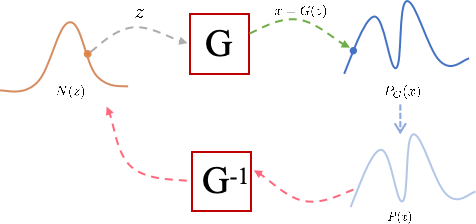

# 第3章 流模型（Flow-based Models）

流模型（Flow-based Models）是一类生成模型，通过可逆变换将简单分布（如高斯分布）映射到复杂数据分布。NICE是早期流模型，通过加性耦合层实现可逆变换，保持雅可比行列式为1，简化计算。RealNVP扩展了NICE，允许雅可比行列式不为1，提升了表达能力。Glow进一步改进，结合可逆1x1卷积和仿射耦合层，生成高质量图像。这些模型通过可逆变换和高效雅可比行列式计算，实现了精确的密度估计和样本生成。

## 3.1 概念与结构

> Everything flows, nothing stands still.（万物皆流，无物常驻。）-- Heraclitus

&emsp;&emsp;生成模型的本质是希望用已知的概率模型来拟合数据样本分布，具体而言如图3.1所示。给定两组数据$z$和$x$，其中$z$服从已知的简单高斯分布$N(z)$，$x$服从复杂的分布$P(x)$代表训练数据的分布，生成模型希望找到一个变换函数$G$使得对于概率分布$N(z)$下的每一个$z$都能经过$G$变换后都能在$P(x)$上存在一个样本点与之对应。

图3.1 生成模型原理

换句话说，$G$的目标是生成的分布$P_G(x)$要尽量与数据分布$P(x)$尽可能接近。流模型的建模思维与此相似，为了实现$z \sim N(z)$到$x=G(z)\sim P_G(x)$的投影，待求解的生成器$G$的表达式为：

$$
G^*=arg\max_{G}\sum_{i=1}^{m}logP_G(x^i)
$$

其中，$P_G(x)$中的样本点与$N(z)$中的样本点的关系为：

$$
P_G(x^i)=N(z^i)(\left |det(J_G)  \right | )^{-1} , z^i=G^{-1}(x^i)
$$

两边取对数得到：

$$
log_{P_G(x^i)}=log_{N(G^{-1}(x^i))}+log_{(\left |det(J_{G^{-1}})  \right | )}
$$

但是求解以上式子存在两个问题，首先是$det(J_{G^{-1}})$并不好计算，因为$G^{-1}$的Jacobian矩阵维度太高，行列式计算量非常大；其次是我们要求解的是$G$但式子中只有$G^{-1}$，因此天然要求$G$可逆，需要巧妙设计其结构。为了让$G^{}$可以计算并易于计算，NICE设计了巧妙的结构叫加性耦合层，由于行列式的计算要比函数求逆要困难，行列式中三角行列式最容易计算，因为三角阵的行列式等于对角线元素之积。所以NICE的思路是尽可能将$G$的Jacobian矩阵转为三角阵，具体而言，NICE将$D$维的$x$分为两部分做下述变换：

$$
h_1=x_1,h_2=x_2+m(x_1)
$$

其中$x_1$，$x_2$是$x$的划分，$m$是$x_1$的任意函数，显而易见这个变换同样是可逆的。相当于将$x$进行变换得到新的变量$h$，这个变换$H$的雅各比矩阵$H^{-1}$是一个三角阵，而对角线全部为1，表示为：

$$
H^{-1}=\begin{pmatrix}
 \mathbb{I}_{1:d} &\mathbb{O} \\
\frac{\partial m}{\partial x_1}   &\mathbb{I}_{d+1:D}
\end{pmatrix}
$$

这样一来，这个变换的雅可比行列式为1，其对数为0，这样就解决了行列式的计算问题。由于$H$变换可逆，但是这个可逆变换是局部的，而我们想要求解的$G$是全局的，于是像流水一样，积跬步至千里，我们多次进行这种简单的变换便可以无限接近理论上的$G$。

$$
\boldsymbol{x} = \boldsymbol{h}^{(0)} \leftrightarrow \boldsymbol{h}^{(1)} \leftrightarrow \boldsymbol{h}^{(2)} \leftrightarrow \dots \leftrightarrow \boldsymbol{h}^{(n-1)} \leftrightarrow \boldsymbol{h}^{(n)} = \boldsymbol{z}
$$

由求导链式法则得：

$$
G^{-1}=\left[\frac{\partial \boldsymbol{z}}{\partial \boldsymbol{x}}\right]=\left[\frac{\partial \boldsymbol{h}^{(n)}}{\partial \boldsymbol{h}^{(0)}}\right]=\left[\frac{\partial \boldsymbol{h}^{(n)}}{\partial \boldsymbol{h}^{(n-1)}}\right]\left[\frac{\partial \boldsymbol{h}^{(n-1)}}{\partial \boldsymbol{h}^{(n-2)}}\right]\dots \left[\frac{\partial \boldsymbol{h}^{(1)}}{\partial \boldsymbol{h}^{(0)}}\right]
$$

由于矩阵的乘积的行列式等于矩阵的行列式的乘积，每一层的行列式为1，所以:

$$
det(J_{G^{-1}})=\det\left[\frac{\partial \boldsymbol{h}^{(n)}}{\partial \boldsymbol{h}^{(n-1)}}\right]\det\left[\frac{\partial \boldsymbol{h}^{(n-1)}}{\partial \boldsymbol{h}^{(n-2)}}\right]\dots \det\left[\frac{\partial \boldsymbol{h}^{(1)}}{\partial \boldsymbol{h}^{(0)}}\right]=1
$$

由于NICE是基于可逆变换的，所以当模型训练完成之后，我们得到了一个生成模型和一个编码模型。但也正是因为可逆变换，随机变量$z$和输入样本$x$具有同一大小。

## 3.2 改进与优化

NICE模型在理论上有重要意义，但由于其简单性，实际应用中存在一定的局限性，主要表现在：

- 表达能力有限：由于加性耦合层的设计较为简单，NICE模型的表达能力相对有限，难以捕捉高度复杂的分布。因此难以生成高质量的图片。
- 耦合层设计限制：NICE的加性耦合层只能对部分维度进行变换，其余维度保持不变，这可能导致模型学习效率较低。因此限制了其适用性。

RealNVP模型是对NICE模型的改进，解决了NICE中的一些关键问题，并提升了生成模型的性能。首先，RealNVP引入了仿射耦合层取代NICE中的加性耦合层，具体而言：

$$
\begin{aligned}&\boldsymbol{h}_{1} = \boldsymbol{x}_{1}\\ 
&\boldsymbol{h}_{2} = \boldsymbol{s}(\boldsymbol{x}_{1})\otimes\boldsymbol{x}_{2} + \boldsymbol{t}(\boldsymbol{x}_{1})\end{aligned}
$$

其中$s$和$t$都是$x_1$的向量函数，操作称为仿射变换$H$。仿射耦合的雅可比矩阵$H^{-1}$依然是一个三角阵，但对角线不全为1，用分块矩阵表示为：

$$
H^{-1}=\begin{pmatrix}
 \mathbb{I}_{d} &\mathbb{O} \\
\frac{\partial \boldsymbol{s}}{\partial \boldsymbol{x}_1}\otimes \boldsymbol{x}_2+\frac{\partial \boldsymbol{t}}{\partial \boldsymbol{x}_1} &s
\end{pmatrix}
$$

显然，根绝对角行列式的计算法则，它的行列式的值$s$的行列式的值，为了保证可逆即$s$的行列式不为0，因此最好约束$s$的各个元素均大于0。由此可见$det(J_{G^{-1}})$的值不一定为0。由于行列式的几何意义就是体积，所以行列式等于1就意味着体积没有变化，而仿射耦合层的行列式不等于1就意味着体积有所变化。这样的变化，使得RealNVP更加灵活，能够捕捉更复杂的分布。

其次，RealNVP通过引入了多尺度架构逐步压缩部分维度并保留关键信息，更高效地处理高维数据，从而生成更高质量的样本。摆脱了直接假设$P(z)$为标准正态分布的限制，而是采用组合式的条件分布。尽管输入与输出的总维度保持一致，不同层次输出的地位已不再对等。模型通过调控每个条件分布的方差，有效缓解了维度浪费的问题。

RealNVP通过引入仿射耦合层、允许雅可比行列式不为1、采用多尺度架构以及更高效的维度变换，解决了NICE模型表达能力有限、生成质量较低等问题，显著提升了生成模型的性能。这些改进使得RealNVP成为流模型发展中的一个重要里程碑。

TODO
