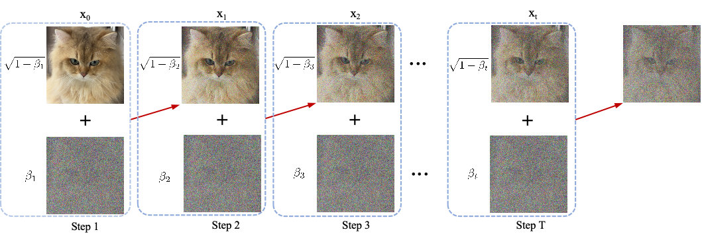
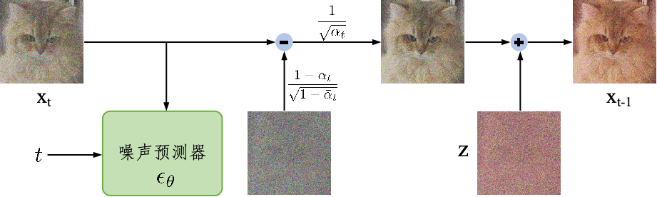
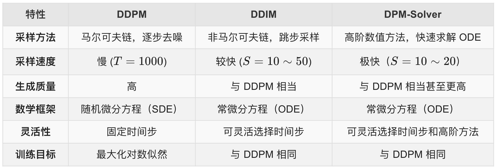
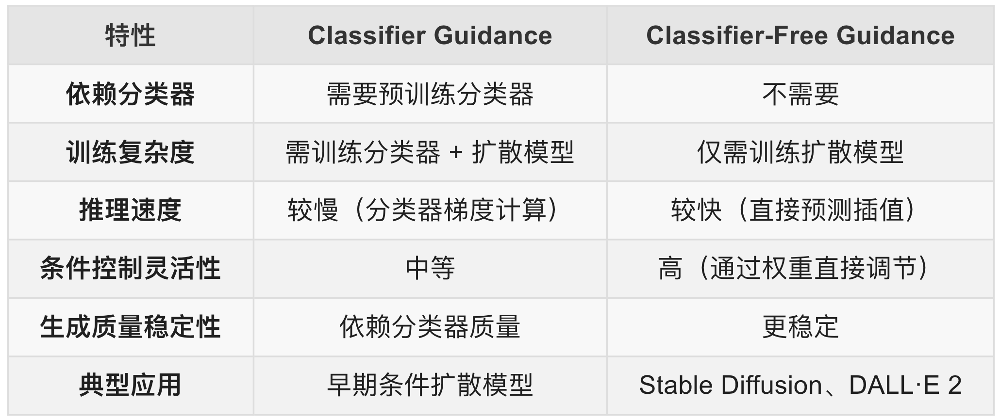

# 第4章 扩散模型

> The universe was born from chaos, and order emerges from disorder.（宇宙从混沌中诞生，秩序从无序中显现）

&emsp;&emsp;扩散模型（Diffusion Models）是生成模型中一种新兴且备受关注的框架，它通过逐步引入和移除噪声的方式学习数据分布，从而生成与输入数据相似的新样本。这种模型在图像生成、音频建模和视频生成等领域表现出色，展现了优异的生成质量和灵活性。扩散模型的核心思想是构建一个前向扩散过程，将数据逐渐转化为纯噪声，同时通过逆向扩散过程学习将噪声还原为数据的能力。基于这种逐步生成的方式，扩散模型能够更精细地控制生成过程，提高生成样本的质量和多样性。近年来，扩散模型的变体如DDPMs和SGMs在生成任务中取得了显著进展。DDPM通过概率建模优化逆向扩散过程，使得模型能够生成高保真数据，而SGMs则通过学习噪声数据的梯度场（即得分函数）实现生成样本的高效推断。尽管扩散模型的训练过程通常计算密集，但其生成过程可以通过优化和改进大幅加速。扩散模型因其优异的表现成为了生成模型研究的热点，不仅推动了生成任务在分辨率和真实性上的突破，还为多模态数据生成、无监督学习等领域带来了新的可能。在后续部分，我们将详细探讨扩散模型的基本原理、前向与逆向扩散过程，以及它们如何通过逐步逼近数据分布，开辟深度生成模型的新方向。

## 4.1 数学基础

在这一小节中，主要介绍理解扩散模型所需要的基础数学知识。数学上，假设A、B表示两个事件发生的概率，则条件概率的乘法公式一般形式是：

$$
P(A)>0, P(AB)=P(A)P(B|A)
$$

推广到多个事件：

$$
\begin{aligned}
P(A,B,C)  &= P(C|B,A)P(B,A) = P(C|B,A)P(B|A)P(A)\\
P(B,C|A)  &= P(B|A)P(C|A,B)
\end{aligned}
$$

其中是关于条件概率、联合概率的计算公式。在进一步引入基于马尔科夫假设的条件概率计算公式之前，我们需要线了解下什么是马尔可夫性？

马尔可夫性是指给定过去的状态$A=\left \{ X_{0},X_{1},...,X_{n-1}  \right \}$和现在的状态$B=X_{n}$，将来的状态的条件分布$C=X_{n+1}$与过去的状态独立，只依赖于现在的状态。所以基于马尔科夫假设的条件概率计算公式为：

$$
\begin{aligned}
P(A,B,C) &= P(C|B)P(B|A)P(A)\\
P(B,C|A) &= P(B|A)P(C|B)
\end{aligned}
$$

可以看出，马尔科夫假设的条件概率计算公式主要是针对条件概率的条件化约束。

接下来简单介绍KL散度公式，在统计学意义上来说，KL散度可以用来衡量两个分布之间的差异程度。若两个分布差异越小，KL散度越小，反之亦反。当两分布一致时，其KL散度为0。正是因为其可以衡量两个分布之间的差异，所以在VAE、EM、GAN中均有使用到KL散度。假设$p$和$q$均是服从正态分布$N(\mu 1,\rho 1)$和$N(\mu 2,\rho 2)$的随机变量的概率密度函数，则从$p$和$q$的KL散度定义为：

$$
KL(p\left |  \right |q)=\int [log(p(x))-log(q(x))]p(x)dx=\int [ p(x)log(p(x))-p(x)log(q(x))]dx
$$

继续推导为：

$$
KL(p,q)=log\frac{\rho 2}{\rho 1}+\frac{\rho 1^{2}+(\mu1-\mu 2)^2 }{2\rho 2^{2}} -\frac{1}{2}
$$

## 4.2 加噪与去噪

去噪扩散概率模型（Denoising Diffusion Probabilistic Models，DDPM）是一种基于扩散过程的生成模型，通过逐步添加和去除噪声来生成数据。DDPM的核心是通过模拟数据的扩散（加噪）和逆扩散（去噪）过程来生成样本。其灵感来源于热力学中的扩散现象，通过两个马尔可夫链过程实现：

* **正向过程（扩散过程）**：逐步向数据添加高斯噪声，直至数据变为纯噪声。
* **反向过程（去噪过程）**：学习从噪声中逐步恢复原始数据。

图4.1 Diffusion加噪过程

加噪过程如图4.1所示，定义一个真实数据分布中采样的点$\mathbf{x}_0 \sim q(\mathbf{x})$，正向过程则是逐渐在这个采样中加入$T$次高斯噪声，这形成一系列高斯噪声采样$\mathbf{x}_1, \dots, \mathbf{x}_T$，其中步长由变量$\{\beta_t \in (0, 1)\}_{t=1}^T$控制。数学描述为：

$$
q(\mathbf{x}_t \vert \mathbf{x}_{t-1}) = \mathcal{N}(\mathbf{x}_t; \sqrt{1 - \beta_t} \mathbf{x}_{t-1}, \beta_t\mathbf{I}) \quad
q(\mathbf{x}_{1:T} \vert \mathbf{x}_0) = \prod^T_{t=1} q(\mathbf{x}_t \vert \mathbf{x}_{t-1})
$$

其中$q(\mathbf{x}_t \vert \mathbf{x}_0)= \mathcal{N}(\mathbf{x}_t; \sqrt{\bar{\alpha}_t} \mathbf{x}_0, (1 - \bar{\alpha}_t)\mathbf{I})$，通过重参数化技巧，可直接从$x_0$计算任意时间步$t$的噪声数据$x_t$：

$$
\begin{aligned}
\mathbf{x}_t &= \sqrt{\alpha_t}\mathbf{x}_{t-1} + \sqrt{1 - \alpha_t}\boldsymbol{\epsilon}_{t-1} \boldsymbol{\epsilon}_{t-2}, \dots \sim \mathcal{N}(\mathbf{0}, \mathbf{I}) \\
   &= \sqrt{\alpha_t \alpha_{t-1}} \mathbf{x}_{t-2} + \sqrt{1 - \alpha_t \alpha_{t-1}} \bar{\boldsymbol{\epsilon}}_{t-2} \\
&= \dots \\
&= \sqrt{\bar{\alpha}_t}\mathbf{x}_0 + \sqrt{1 - \bar{\alpha}_t}\boldsymbol{\epsilon} \\
\end{aligned}
$$

其中，$\alpha_t = \prod_{s=1}^t (1-\beta_s) $，且$ \alpha_t $随$ t $增大而递减，$\epsilon$是噪声。采样数据$\mathbf{x}_0$在$t$逐渐变大的过程中逐渐失去它原有的分布，当$T \to \infty$时，$\mathbf{x}_T$就等价于一个各向异性高斯分布。

上述过程反过来采样$q(\mathbf{x}_{t-1} \vert \mathbf{x}_t)$，将逐渐地从高斯噪声分布$\mathbf{x}_T \sim \mathcal{N}(\mathbf{0}, \mathbf{I})$中逐恢复出真实的数据$x_0$。但是有两点需要注意，首先是如果步长$\beta_t$太小则$q(\mathbf{x}_{t-1} \vert \mathbf{x}_t)$也还是高斯噪声分布，其次是由于并不知道整体数据的真实分布所以我们不能很简单的估计$q(\mathbf{x}_{t-1} \vert \mathbf{x}_t)$。因此我们用模型学习一个参数$p_\theta$来估计这个条件概率分布从而来实现这个反向过程。

$$
p_\theta(\mathbf{x}_{0:T}) = p(\mathbf{x}_T) \prod^T_{t=1} p_\theta(\mathbf{x}_{t-1} \vert \mathbf{x}_t) \quad
p_\theta(\mathbf{x}_{t-1} \vert \mathbf{x}_t) = \mathcal{N}(\mathbf{x}_{t-1}; \boldsymbol{\mu}_\theta(\mathbf{x}_t, t), \boldsymbol{\Sigma}_\theta(\mathbf{x}_t, t))
$$

值得注意的是可以从$\mathbf{x}_0$很容易地控制这个反向的条件概率过程：

$$
q(\mathbf{x}_{t-1} \vert \mathbf{x}_t, \mathbf{x}_0) = \mathcal{N}(\mathbf{x}_{t-1}; {\tilde{\boldsymbol{\mu}}}(\mathbf{x}_t, \mathbf{x}_0), {\tilde{\beta}_t} \mathbf{I})
$$

原因是：

$$
{\tilde{\boldsymbol{\mu}}}(\mathbf{x}_t, \mathbf{x}_0) = \frac{\sqrt{\bar{\alpha}_{t-1}} \beta_t}{1 - \bar{\alpha}_t} \mathbf{x}_0 + \frac{\sqrt{\alpha_t} (1 - \bar{\alpha}_{t-1})}{1 - \bar{\alpha}_t} \mathbf{x}_t
$$

其中，$\alpha_t$和$\bar{\alpha}_t$是预定义的噪声调度参数，$\beta_t$是前向过程的噪声方差。由上式可以看到，$\tilde{\boldsymbol{\mu}}(\mathbf{x}_t, \mathbf{x}_0)$ 是 $\mathbf{x}_0$ 和 $\mathbf{x}_t$ 的线性组合，因此如果我们能够准确估计 $\mathbf{x}_0$，就能直接控制反向过程的均值，从而影响整个去噪过程。可以把扩散模型的反向过程想象成一个逐步去噪的过程，而$\mathbf{x}_0$相当于这个过程的“终点”或者“目标”。每一步的去噪都是在向$\mathbf{x}_0$ 逼近，因此如果我们能控制$\mathbf{x}_0$，整个去噪过程就会按照我们希望的方式进行。总结来说，$\mathbf{x}_0$直接决定了反向过程的均值，因此我们可以通过它来控制整个反向扩散过程，使其朝向期望的生成目标发展。

去噪过程数学表示如下：

$$
\mathbf{x}_{t-1} = \frac{1}{\sqrt{\alpha_t}}\left ( \mathbf{x}_{t}-\frac{1 - \alpha_t}{\sqrt{1 -\bar{\alpha}_t }}\epsilon_\theta(\mathbf{x}_t, t)   \right )   + \sigma_t\mathbf{z}
$$

其中，$\mathbf{z}$表示服从$\mathcal{N}(\mathbf{0}, \mathbf{I})$分布的随机噪声，过程如图4.2所示。

图4.2 Diffusion去噪过程

DDPM的目的是需要得到最优的$\theta$，为此优化目标是通过最大化变分下界（ELBO）进行训练，损失函数简化为预测噪声的均方误差：

$$
\mathcal{L}(\theta) = \mathbb{E}_{t, x_0, \epsilon} \left[ \| \epsilon - \epsilon_\theta(x_t, t) \|^2 \right]
$$

其中，$t$ 从 $ \{1, ..., T\} $均匀采样，$x_t = \sqrt{\alpha_t} x_0 + \sqrt{1-\alpha_t} \epsilon $，其中$ \epsilon \sim \mathcal{N}(0, \mathbf{I}) $。$\theta$用于预测噪声的神经网络通常采用U-Net结构，结合残差连接和时间步嵌入。DDPM相比与其他生成模型的优缺点也非常明显：

* 生成质量高，尤其在图像细节和多样性上优于GAN。
* 训练稳定，无需对抗训练，但是生成速度慢，需多次迭代（通常数百至上千步）。
* 理论推导严密，过程可解释强。

## 4.3 采样加速

DDPM通过马尔可夫链逐步添加和去除噪声，但采样步骤多，速度慢，并且马尔可夫链的严格依赖性限制了采样灵活性。因此自然会想这个采样过程如何加速？

### 4.3.1 从百到十

DDIM打破马尔可夫链的假设，允许更少的步骤生成高质量样本。DDIM的核心思想是通过非马尔可夫链的方式加速采样，使得采样过程从千百步缩小到十几步，同时保持与DDPM相同的训练目标。其中，DDIM定义了一个非马尔可夫的前向过程，使得$\mathbf{x}_t$可以直接从$\mathbf{x}_0$生成：

$$
\mathbf{x}_t = \sqrt{\alpha_t} \mathbf{x}_0 + \sqrt{1-\alpha_t} \mathbf{\epsilon}
$$

其中，$\alpha_t$是噪声调度参数，$\mathbf{\epsilon}$是标准高斯噪声。

DDIM的反向过程（采样过程）是非马尔可夫的，允许跳过某些时间步，从而加速采样。采样公式为：

$$
\mathbf{x}_{t-1} = \sqrt{\alpha_{t-1}} \hat{\mathbf{x}}_0 + \sqrt{1-\alpha_{t-1}} \mathbf{\epsilon}_\theta(\mathbf{x}_t, t)
$$

其中，$\hat{\mathbf{x}}_0$ 是从当前状态 $\mathbf{x}_t$ 预测的初始状态：

$$
\hat{\mathbf{x}}_0 = \frac{\mathbf{x}_t - \sqrt{1-\alpha_t} \mathbf{\epsilon}_\theta(\mathbf{x}_t, t)}{\sqrt{\alpha_t}}
$$

其核心思想是通过直接预测初始状态$x_0$和噪声$\epsilon_{\theta}$，实现灵活且高效的采样。对比DDPM表现为两个关键性区别：

* DDIM通过直接预测初始数据$x_0$的估计值，构造确定性路径，绕过马尔可夫链的严格依赖。
* DDIM的采样过程可视为常微分方程求解（ODE），而DDPM对应随机微分方程求解（SDE）。确定性采样便于控制生成过程（如插值、隐空间编辑）。

### 4.3.2 从十到一

DPM-Solver是一种基于扩散概率模型（Diffusion Probabilistic Models, DPM）的快速采样方法，旨在通过高阶数值方法加速采样过程。因此，DPM-Solver的核心思想与DDIM相似，是将扩散模型的反向过程视为一个常微分方程（ODE），但是它用了高阶数值方法（如 Runge-Kutta 方法）求解该ODE，从而实现快速采样，具体方法推导不在此赘述。如图4.2所示，在与DDPM和DDIM相比，DPM-Solver在保证生成质量的同时显著减少了采样步数。

表4.1 DPM-Solver与DDPM和DDIM的对比

## 4.4 架构优化

DDPM自2020年被提出以来，迅速成为生成建模领域的核心技术之一，并在图像、视频、3D 生成、语音合成、音乐生成等多个模态中展现了卓越的性能。扩散模型在生成质量和稳定性上优于传统的生成对抗网络（GAN）和变分自编码器（VAE），但其原始版本仍然存在着较大的计算开销、较慢的采样速度以及可控性有限等问题。前一章节主要从效率的角度出发，解决了DDPM在采样过程中速度慢的问题，本章节主要从质量的角度出发，介绍一些提升扩散模型可控性和提高生成质量的工作。

### 4.4.1 条件控制

在扩散模型中，条件生成（如生成特定类别的图像或文本到图像）是关键需求，它使得模型不仅能够生成高质量样本，还能根据用户提供的先验信息进行控制，从而满足实际应用需求。

在早期的条件扩散模型中，使用Classifier Guidance（CG）来进行条件控制，其核心思想是通过预训练的分类器提供梯度信号，调整扩散过程，使生成样本满足特定条件（如类别标签、文本描述）。具体而言，在扩散模型的噪声空间上训练一个分类器$p_\phi(y \mid x_t, t)$，其中$y$是条件（如类别标签），在采样时，将分类器的梯度信息注入到扩散模型的噪声预测中：

$$
\hat{\epsilon}_\theta(x_t, t, y) = \epsilon_\theta(x_t, t) - s \cdot \sigma_t \nabla_{x_t} \log p_\phi(y \mid x_t, t)
$$

其中，$s$是引导强度（guidance scale），控制条件的影响；$\sigma_t$是噪声调度参数。这样做的优点是可利用强大的预训练分类器提升生成精度并且可以灵活适配不同条件（类别、文本等），但是缺点也十分明显：

- 需额外训练分类器，增加计算成本；
- 分类器可能在噪声数据上表现不稳定；
- 梯度计算增加采样时间。

为了解决以上缺点，Classifier-Free Guidance（CFG）不依赖外部分类器，而是通过一个隐式的分类器来替代显示分类器，而无需直接计算显式分类器及其梯度。在训练时随机丢弃条件信息，使模型同时学习有条件生成和无条件生成，并通过插值权重控制生成方向：

$$
\hat{\epsilon}_\theta(x_t, t, y) = \epsilon_\theta(x_t, t, \emptyset) + s \cdot \left( \epsilon_\theta(x_t, t, y) - \epsilon_\theta(x_t, t, \emptyset) \right)
$$

首先，在训练时以概率$p_{\text{drop}}$随机将条件$y$替换为空集$\emptyset$，迫使模型同时掌握两种生成模式；并且，让模型需预测有条件噪声$\epsilon_\theta(x_t, t, y)$ 和无条件噪声$\epsilon_\theta(x_t, t, \emptyset)$，从而联合训练目标；最终，在推理时插值，生成时混合有条件和无条件预测。其中$s$ 控制条件强度（通常$s \geq 1$）。

表4.2 CG和CFG对比总结

### 4.4.2 结构优化

作为扩散模型的奠基性工作，去噪扩散概率模型（Denoising Diffusion Probabilistic Models, DDPM）通过U-Net架构构建了噪声预测网络的核心范式。为突破原始框架在计算效率、生成质量与控制能力等方面的限制，后续研究者从三个维度展开了系统性优化：

#### **1. 潜在空间扩散（Latent Diffusion）**

核心思想是将高维像素空间（如256×256×3）的扩散过程迁移至低维潜在空间，实现计算复杂度的大幅降低：

1. **编码阶段**：采用预训练的变分自编码器（VAE）或矢量量化VAE（VQ-VAE）将图像压缩至潜在空间$z \in \mathbb{R}^{h \times w \times c}$，其中$h,w \ll H,W$（如Stable Diffusion采用4倍下采样，潜在空间维度为64×64×4）。
2. **扩散阶段**：在潜在空间执行正向加噪与反向去噪过程，通过马尔可夫链建模$z_{0:T}$的渐进式转换。
3. **重建阶段**：利用解码器$D(z_0)$将去噪后的潜在变量$z_0$映射回像素空间。
   **优势**：相比像素级扩散（如DDPM），计算量降低约5-10倍（Latent Diffusion, Rombach et al. 2022），同时保持生成质量。

#### **2. U-Net架构的深度优化**

**(a) 高效残差模块设计**

- 采用ConvNeXt Block等现代卷积模块替换传统残差块，通过深度可分离卷积、通道重加权等机制提升特征表达能力，参数量减少30%的同时PSNR提升1.2dB（参考EDM模型）。
- 引入动态卷积核（如条件参数化卷积），根据时间步$t$和条件输入动态调整卷积权重，增强时序适应性。

**(b) 多尺度注意力增强**

- 在跳跃连接（Skip Connection）中嵌入交叉注意力机制，实现文本-图像对齐（如Stable Diffusion的CLIP-guided Attention）。
- 构建分层注意力网络：在低分辨率层使用窗口注意力（Window Attention）捕获局部结构，高分辨率层采用稀疏全局注意力降低计算开销。

**(c) 层次化扩散框架**

- 采用级联式生成策略：首阶段在64×64分辨率生成语义轮廓，后续阶段依次进行128×128、256×256分辨率的细节细化（Imagen, Saharia et al. 2022）。
- 通过课程学习（Curriculum Learning）策略渐进式训练多级模型，避免直接训练高分辨率模型的收敛困难。

**(d) 混合架构创新**

- **UViT架构**（Chen et al. 2023）：以Vision Transformer作为U-Net主干，在编码器-解码器间引入可学习的桥接层，在ImageNet 256×256生成任务上FID降至2.1。
- **纯Transformer架构**（DiT, Peebles et al. 2023）：完全摒弃卷积操作，通过Patch Embedding将输入转换为序列，在类条件ImageNet基准测试中FID达到1.8，超越传统U-Net结构。

---

#### **3. 轻量化与实时生成技术**

**(a) 知识蒸馏压缩**

- **渐进式蒸馏**（Progressive Distillation, Salimans et al. 2022）：通过多轮迭代将教师模型的千步扩散过程压缩至4-8步，推理速度提升200倍。
- **Tiny Diffusion架构**：设计通道数缩减的U-Net，配合分组卷积与通道剪枝，模型体积缩小至原版的1/5（<50MB），适用于移动端部署。

**(b) 稀疏扩散策略**

- **掩码引导扩散**（Masked Diffusion, Zheng et al. 2023）：通过显著性检测定位关键区域（如物体边缘），仅对10%-20%的高频区域执行完整扩散过程，FLOPs降低40%。
- **自适应步长调度**：基于图像局部复杂度动态分配去噪步数，平坦区域采用大步长跳跃式更新，纹理丰富区域精细化处理。

#### 4.总结

| 优化方向     | 代表方法         | 性能增益                     | 适用场景         |
| ------------ | ---------------- | ---------------------------- | ---------------- |
| 潜在空间压缩 | Stable Diffusion | 训练速度×5↑, VRAM占用×3↓ | 高分辨率图像生成 |
| 混合架构     | DiT              | FID 1.8 (ImageNet 256)       | 复杂语义场景生成 |
| 级联式生成   | Imagen           | 人类偏好评分↑35%            | 文本到图像生成   |
| 渐进式蒸馏   | LCM              | 实时生成 (30ms/image)        | 交互式应用       |

当前研究正朝着**多模态条件控制**、**物理启发生成**（如流体动力学约束）和**极低步长生成**（1-2步高质量输出）等方向突破，持续推动扩散模型在工业级应用中的落地。
